# Razor Pages - Listar Vehículos (Index)

## 📘 Página de Listado

Este documento explica la implementación de la **página principal para listar todos los vehículos** usando Razor Pages.

---

## 🎯 Objetivo

Mostrar una lista de todos los vehículos registrados con opciones para ver detalle, editar y eliminar.

**URL**: `/Vehiculos` o `/Vehiculos/Index`

**Método**: GET

---

## 🔄 Flujo Completo Server-Side

```mermaid
sequenceDiagram
    participant User as Usuario (Browser)
    participant Browser as Navegador
    participant Web as Kestrel Server
    participant PM as IndexModel (PageModel)
    participant Config as IConfiguracion
    participant HC as HttpClient
    participant API as Vehiculo.API
    participant View as Index.cshtml
    
    User->>Browser: 1. Click "Ver Vehículos"
    Browser->>Web: 2. GET /Vehiculos
    Web->>PM: 3. Crear instancia de IndexModel
    Web->>PM: 4. Inyectar IConfiguracion (DI)
    Web->>PM: 5. OnGetAsync()
    
    PM->>Config: 6. ObtenerMetodo("API", "Vehiculos")
    Config-->>PM: 7. "https://localhost:7001/api/Vehiculo"
    
    PM->>HC: 8. new HttpClient()
    PM->>HC: 9. GetAsync(endpoint)
    HC->>API: 10. HTTP GET /api/Vehiculo
    API-->>HC: 11. 200 OK + VehiculoResponse[] JSON
    HC-->>PM: 12. HttpResponseMessage
    
    PM->>PM: 13. ReadAsStringAsync()
    PM->>PM: 14. JsonSerializer.Deserialize<List<VehiculoResponse>>()
    PM->>PM: 15. Vehiculos = lista
    PM-->>Web: 16. return Page()
    
    Web->>View: 17. Procesar Index.cshtml con Model
    View->>View: 18. @foreach (var vehiculo in Model.Vehiculos)
    View->>View: 19. Generar HTML con Bootstrap
    View-->>Web: 20. HTML completo
    
    Web-->>Browser: 21. HTTP Response (HTML)
    Browser->>Browser: 22. Renderizar HTML
    Browser-->>User: 23. Mostrar página
```



---

## 💻 Implementación

### 1. PageModel (Backend C#)

```csharp
// Pages/Vehiculos/Index.cshtml.cs
using Microsoft.AspNetCore.Mvc.RazorPages;
using System.Text.Json;
using Abstracciones.Modelos;
using Abstracciones.Interfaces.Reglas;

namespace Vehiculos.WEB.Pages.Vehiculos
{
    /// <summary>
    /// PageModel para la página de listado de vehículos.
    /// </summary>
    public class IndexModel : PageModel
    {
        private readonly IConfiguracion _configuracion;

        /// <summary>
        /// Lista de vehículos a mostrar en la vista.
        /// </summary>
        public List<VehiculoResponse> Vehiculos { get; set; } = new List<VehiculoResponse>();

        /// <summary>
        /// Indica si hubo un error al cargar los datos.
        /// </summary>
        public bool HayError { get; set; } = false;

        /// <summary>
        /// Mensaje de error si lo hay.
        /// </summary>
        public string MensajeError { get; set; } = string.Empty;

        public IndexModel(IConfiguracion configuracion)
        {
            _configuracion = configuracion;
        }

        /// <summary>
        /// Maneja la request GET inicial.
        /// Obtiene los vehículos desde el API.
        /// </summary>
        public async Task OnGetAsync()
        {
            try
            {
                // 1. Obtener endpoint desde configuración
                string endpoint = _configuracion.ObtenerMetodo("API", "Vehiculos");

                // 2. Crear HttpClient
                using var cliente = new HttpClient();

                // 3. Crear y enviar request
                var solicitud = new HttpRequestMessage(HttpMethod.Get, endpoint);
                var respuesta = await cliente.SendAsync(solicitud);

                // 4. Verificar código de estado
                if (respuesta.StatusCode == System.Net.HttpStatusCode.NoContent)
                {
                    // 204: No hay vehículos
                    Vehiculos = new List<VehiculoResponse>();
                    return;
                }

                // 5. Lanzar excepción si no es exitoso
                respuesta.EnsureSuccessStatusCode();

                // 6. Leer y deserializar JSON
                var contenido = await respuesta.Content.ReadAsStringAsync();

                Vehiculos = JsonSerializer.Deserialize<List<VehiculoResponse>>(contenido, new JsonSerializerOptions
                {
                    PropertyNameCaseInsensitive = true
                }) ?? new List<VehiculoResponse>();
            }
            catch (HttpRequestException ex)
            {
                // Error de conexión con el API
                HayError = true;
                MensajeError = $"Error al conectar con el servidor: {ex.Message}";
            }
            catch (JsonException ex)
            {
                // Error al deserializar JSON
                HayError = true;
                MensajeError = $"Error al procesar los datos: {ex.Message}";
            }
            catch (Exception ex)
            {
                // Cualquier otro error
                HayError = true;
                MensajeError = $"Error inesperado: {ex.Message}";
            }
        }
    }
}
```

**Características**:
- ✅ Hereda de `PageModel`
- ✅ Propiedades públicas accesibles desde la vista
- ✅ `OnGetAsync()`: Handler para GET requests
- ✅ Manejo de errores completo
- ✅ Manejo de 204 No Content

---

### 2. Vista Razor (Frontend HTML + C#)

```html
@* Pages/Vehiculos/Index.cshtml *@
@page
@model Vehiculos.WEB.Pages.Vehiculos.IndexModel
@{
    ViewData["Title"] = "Vehículos";
}

<!-- Header con botón Agregar -->
<div class="container mt-4">
    <div class="row mb-4">
        <div class="col-md-8">
            <h1 class="display-4">
                <i class="bi bi-car-front-fill text-primary"></i> 
                Gestión de Vehículos
            </h1>
            <p class="lead text-muted">Lista completa de vehículos registrados</p>
        </div>
        <div class="col-md-4 text-end d-flex align-items-center justify-content-end">
            <a asp-page="./Agregar" class="btn btn-primary btn-lg shadow">
                <i class="bi bi-plus-circle"></i> Agregar Vehículo
            </a>
        </div>
    </div>

    <!-- Manejo de errores -->
    @if (Model.HayError)
    {
        <div class="alert alert-danger alert-dismissible fade show" role="alert">
            <i class="bi bi-exclamation-triangle-fill"></i>
            <strong>Error:</strong> @Model.MensajeError
            <button type="button" class="btn-close" data-bs-dismiss="alert"></button>
        </div>
    }

    <!-- Mensaje si no hay vehículos -->
    @if (!Model.HayError && !Model.Vehiculos.Any())
    {
        <div class="alert alert-info shadow-sm">
            <i class="bi bi-info-circle-fill"></i>
            <strong>No hay vehículos registrados.</strong>
            <a asp-page="./Agregar" class="alert-link">Agregar el primero</a>.
        </div>
    }

    <!-- Grid de vehículos con Bootstrap Cards -->
    @if (Model.Vehiculos.Any())
    {
        <div class="row">
            <div class="col-12 mb-3">
                <p class="text-muted">
                    <i class="bi bi-list-ul"></i> 
                    Mostrando <strong>@Model.Vehiculos.Count</strong> vehículos
                </p>
            </div>
        </div>

        <div class="row row-cols-1 row-cols-md-2 row-cols-lg-3 g-4">
            @foreach (var vehiculo in Model.Vehiculos)
            {
                <div class="col">
                    <div class="card h-100 shadow-sm hover-shadow transition">
                        <!-- Header con marca y modelo -->
                        <div class="card-header bg-primary text-white">
                            <h5 class="card-title mb-0">
                                <i class="bi bi-car-front"></i>
                                @vehiculo.Marca @vehiculo.Modelo
                            </h5>
                        </div>

                        <!-- Body con información -->
                        <div class="card-body">
                            <dl class="row mb-0">
                                <dt class="col-5">Placa:</dt>
                                <dd class="col-7">
                                    <span class="badge bg-secondary">@vehiculo.Placa</span>
                                </dd>

                                <dt class="col-5">Color:</dt>
                                <dd class="col-7">@vehiculo.Color</dd>

                                <dt class="col-5">Año:</dt>
                                <dd class="col-7">@vehiculo.Anio</dd>

                                <dt class="col-5">Precio:</dt>
                                <dd class="col-7">
                                    <strong class="text-success">
                                        @vehiculo.Precio.ToString("C", new System.Globalization.CultureInfo("es-CO"))
                                    </strong>
                                </dd>

                                <dt class="col-5">Propietario:</dt>
                                <dd class="col-7 small text-muted">
                                    <i class="bi bi-envelope"></i> @vehiculo.CorreoPropietario
                                </dd>
                            </dl>
                        </div>

                        <!-- Footer con acciones -->
                        <div class="card-footer bg-transparent">
                            <div class="btn-group w-100" role="group">
                                <a asp-page="./Detalle" 
                                   asp-route-id="@vehiculo.Id" 
                                   class="btn btn-sm btn-info text-white"
                                   title="Ver detalle">
                                    <i class="bi bi-info-square"></i> Ver
                                </a>

                                <a asp-page="./Editar" 
                                   asp-route-id="@vehiculo.Id" 
                                   class="btn btn-sm btn-warning"
                                   title="Editar vehículo">
                                    <i class="bi bi-pencil-square"></i> Editar
                                </a>

                                <a asp-page="./Eliminar" 
                                   asp-route-id="@vehiculo.Id" 
                                   class="btn btn-sm btn-danger"
                                   title="Eliminar vehículo">
                                    <i class="bi bi-trash"></i> Eliminar
                                </a>
                            </div>
                        </div>
                    </div>
                </div>
            }
        </div>
    }
</div>

@* CSS personalizado *@
@section Styles {
    <style>
        .hover-shadow {
            transition: box-shadow 0.3s ease;
        }
        
        .hover-shadow:hover {
            box-shadow: 0 0.5rem 1rem rgba(0, 0, 0, 0.15) !important;
        }
        
        .transition {
            transition: transform 0.2s ease;
        }
        
        .transition:hover {
            transform: translateY(-5px);
        }
    </style>
}
```

**Elementos Razor**:
- ✅ `@page`: Define que es una Razor Page
- ✅ `@model`: Especifica el tipo de PageModel
- ✅ `Model.Propiedad`: Accede a propiedades del PageModel
- ✅ `asp-page`: Tag Helper para navegación entre páginas
- ✅ `asp-route-id`: Pasa parámetro en la URL
- ✅ `@foreach`: Loop en C# embebido
- ✅ `@if`: Condicionales en C#
- ✅ `@section Styles`: Define sección para el layout

---

## 🎨 Tag Helpers Explicados

### asp-page

```html
<!-- Genera URL relativa a otra Razor Page -->
<a asp-page="./Agregar">Agregar</a>
<!-- Resultado: <a href="/Vehiculos/Agregar">Agregar</a> -->
```

### asp-route-{parametro}

```html
<!-- Pasa parámetros en la URL -->
<a asp-page="./Detalle" asp-route-id="@vehiculo.Id">Ver</a>
<!-- Resultado: <a href="/Vehiculos/Detalle/12345678-...">Ver</a> -->
```

**Ventaja**: ASP.NET Core genera las URLs automáticamente, no hardcoding.

---

## ⚙️ Configuración (appsettings.json)

```json
{
  "API": {
    "Vehiculos": "https://localhost:7001/api/Vehiculo",
    "Marcas": "https://localhost:7001/api/Marca",
    "Modelos": "https://localhost:7001/api/Modelo"
  }
}
```

### IConfiguracion

```csharp
// Reglas/Configuracion.cs
public class Configuracion : IConfiguracion
{
    private readonly IConfiguration _configuration;

    public Configuracion(IConfiguration configuration)
    {
        _configuration = configuration;
    }

    public string ObtenerMetodo(string seccion, string metodo)
    {
        return _configuration[$"{seccion}:{metodo}"];
    }
}
```

**Uso**:
```csharp
string url = _configuracion.ObtenerMetodo("API", "Vehiculos");
// Resultado: "https://localhost:7001/api/Vehiculo"
```

---

## 📊 Comparación con React

| Aspecto | **Razor Pages (Index)** | **React (VehiculosPage)** |
|---------|------------------------|---------------------------|
| **Rendering** | Server-Side | Client-Side |
| **Data Fetching** | `OnGetAsync()` en servidor | `useEffect() + fetch()` en cliente |
| **Estado** | No persiste (nueva request = nuevo PageModel) | Persiste en memoria (`useState`) |
| **Loading** | Mientras servidor procesa (~200ms) | Spinner en UI explícito |
| **Navegación** | Full page reload | Sin reload (React Router) |
| **SEO** | ✅ HTML completo desde inicio | ⚠️ Requiere SSR |
| **Primera carga** | ✅ Rápida | ⚠️ Descarga JS bundle |
| **UI Framework** | Bootstrap 5 | Tailwind CSS |
| **Interactividad** | ⚠️ Requiere JavaScript adicional | ✅ Por defecto |
| **Paginación** | En servidor | En cliente |

---

## 🚀 Performance

### Optimizaciones

```csharp
// 1. Caché en PageModel
[ResponseCache(Duration = 60)] // Cache 1 minuto
public async Task OnGetAsync()
{
    // ...
}

// 2. HttpClient reutilizable
private static readonly HttpClient _httpClient = new HttpClient();

// 3. Streaming para listas grandes
public async IAsyncEnumerable<VehiculoResponse> ObtenerVehiculosStreaming()
{
    // Yield return conforme se obtienen
}
```

---

## 🧪 Testing

```csharp
// Vehiculos.WEB.Tests/IndexModelTests.cs
public class IndexModelTests
{
    [Fact]
    public async Task OnGetAsync_APIRetornaVehiculos_CargaLista()
    {
        // Arrange
        var mockConfig = new Mock<IConfiguracion>();
        mockConfig.Setup(c => c.ObtenerMetodo("API", "Vehiculos"))
                  .Returns("https://api-test/vehiculos");

        var model = new IndexModel(mockConfig.Object);

        // Mockear HttpClient es complejo, usar WebApplicationFactory
        
        // Act
        await model.OnGetAsync();

        // Assert
        Assert.NotNull(model.Vehiculos);
    }
}
```

---

## 📚 Documentos Relacionados

- **[Web - Agregar Vehículo](./02-web-post-crear-vehiculo.md)** - Crear nuevo
- **[Web - Detalle Vehículo](./03-web-get-detalle-vehiculo.md)** - Ver uno específico
- **[Web - Arquitectura General](./vehiculos-web-arquitectura.md)** - Visión completa

---

**Siguiente**: [02 - Agregar Vehículo (Crear)](./02-web-post-crear-vehiculo.md)
