# Razor Pages - Agregar Vehículo (Create)

## 📘 Página de Creación

Este documento explica la implementación de la **página para crear un nuevo vehículo** con formulario completo.

---

## 🎯 Objetivo

Permitir al usuario registrar un nuevo vehículo mediante un formulario con validación.

**URL**: `/Vehiculos/Agregar`

**Métodos**: 
- **GET**: Mostrar formulario vacío
- **POST**: Procesar datos y crear vehículo

---

## 🔄 Flujo Completo con Form Submit

```mermaid
sequenceDiagram
    participant User as Usuario
    participant Browser as Navegador
    participant Web as Kestrel Server
    participant PM as AgregarModel
    participant HC as HttpClient
    participant API as Vehiculo.API
    
    Note over User,API: FASE 1: GET - Mostrar Formulario
    
    User->>Browser: 1. Click "Agregar Vehículo"
    Browser->>Web: 2. GET /Vehiculos/Agregar
    Web->>PM: 3. OnGetAsync()
    PM->>HC: 4. Obtener marcas y modelos desde API
    HC->>API: 5. GET /api/Marca y /api/Modelo
    API-->>HC: 6. JSON con datos
    HC-->>PM: 7. Deserializar a List<Marca>, List<Modelo>
    PM->>PM: 8. Marcas = lista, Modelos = lista
    PM-->>Web: 9. return Page()
    Web->>Browser: 10. Renderear Agregar.cshtml con formulario
    Browser-->>User: 11. Mostrar formulario
    
    Note over User,API: FASE 2: POST - Enviar Formulario
    
    User->>Browser: 12. Completar formulario + Submit
    Browser->>Web: 13. POST /Vehiculos/Agregar<br/>(Form Data)
    Web->>PM: 14. Model Binding automático<br/>(Form → Vehiculo propiedad)
    Web->>PM: 15. Validar ModelState
    
    alt ModelState inválido
        PM-->>Web: return Page() (re-mostrar con errores)
        Web-->>Browser: HTML con errores de validación
        Browser-->>User: Mostrar errores en campos
    end
    
    PM->>PM: 16. OnPostAsync()
    PM->>HC: 17. Serializar Vehiculo a JSON
    PM->>HC: 18. PostAsync(endpoint, JSON)
    HC->>API: 19. HTTP POST /api/Vehiculo
    API->>API: 20. Crear en BD
    API-->>HC: 21. 201 Created + Location header
    HC-->>PM: 22. HttpResponseMessage
    PM->>PM: 23. Extraer nuevo ID del Location header
    PM-->>Web: 24. RedirectToPage("./Index")
    Web-->>Browser: 25. HTTP 302 Redirect
    Browser->>Web: 26. GET /Vehiculos (nueva request)
    Web-->>Browser: 27. Página Index actualizada
    Browser-->>User: 28. Mostrar lista con nuevo vehículo
```



---

## 💻 Implementación

### 1. PageModel

```csharp
// Pages/Vehiculos/Agregar.cshtml.cs
using Microsoft.AspNetCore.Mvc;
using Microsoft.AspNetCore.Mvc.RazorPages;
using System.Text;
using System.Text.Json;
using Abstracciones.Modelos;
using Abstracciones.Interfaces.Reglas;

namespace Vehiculos.WEB.Pages.Vehiculos
{
    public class AgregarModel : PageModel
    {
        private readonly IConfiguracion _configuracion;

        /// <summary>
        /// [BindProperty] enlaza automáticamente el form data a esta propiedad.
        /// SupportsGet = false significa solo en POST.
        /// </summary>
        [BindProperty]
        public VehiculoRequest Vehiculo { get; set; } = new();

        /// <summary>
        /// Listas para los dropdowns del formulario.
        /// </summary>
        public List<Marca> Marcas { get; set; } = new();
        public List<Modelo> Modelos { get; set; } = new();

        public string MensajeError { get; set; } = string.Empty;

        public AgregarModel(IConfiguracion configuracion)
        {
            _configuracion = configuracion;
        }

        /// <summary>
        /// GET: Cargar formulario vacío con datos necesarios (marcas/modelos).
        /// </summary>
        public async Task OnGetAsync()
        {
            await CargarDatosFormulario();
        }

        /// <summary>
        /// POST: Procesar formulario enviado.
        /// </summary>
        public async Task<IActionResult> OnPostAsync()
        {
            // 1. Verificar validación automática
            if (!ModelState.IsValid)
            {
                // Re-cargar datos del formulario
                await CargarDatosFormulario();
                return Page(); // Mostrar formulario con errores
            }

            try
            {
                // 2. Obtener endpoint del API
                string endpoint = _configuracion.ObtenerMetodo("API", "Vehiculos");

                using var cliente = new HttpClient();

                // 3. Serializar objeto a JSON
                var json = JsonSerializer.Serialize(Vehiculo, new JsonSerializerOptions
                {
                    PropertyNamingPolicy = JsonNamingPolicy.CamelCase
                });

                var content = new StringContent(json, Encoding.UTF8, "application/json");

                // 4. Enviar POST request
                var respuesta = await cliente.PostAsync(endpoint, content);

                // 5. Verificar respuesta
                if (!respuesta.IsSuccessStatusCode)
                {
                    var error = await respuesta.Content.ReadAsStringAsync();
                    MensajeError = $"Error del servidor: {respuesta.StatusCode} - {error}";
                    await CargarDatosFormulario();
                    return Page();
                }

                // 6. ⭐ Extraer ID del Location header (opcional)
                var locationHeader = respuesta.Headers.Location?.ToString();
                var nuevoId = locationHeader?.Split('/').LastOrDefault();

                // 7. ⭐ Redirigir a Index con mensaje de éxito
                TempData["Mensaje"] = "Vehículo creado exitosamente";
                TempData["TipoMensaje"] = "success";
                return RedirectToPage("./Index");
            }
            catch (HttpRequestException ex)
            {
                MensajeError = $"Error de conexión: {ex.Message}";
                await CargarDatosFormulario();
                return Page();
            }
            catch (Exception ex)
            {
                MensajeError = $"Error inesperado: {ex.Message}";
                await CargarDatosFormulario();
                return Page();
            }
        }

        /// <summary>
        /// Helper para cargar marcas y modelos desde el API.
        /// </summary>
        private async Task CargarDatosFormulario()
        {
            try
            {
                using var cliente = new HttpClient();

                // Cargar marcas
                var endpointMarcas = _configuracion.ObtenerMetodo("API", "Marcas");
                var respuestaMarcas = await cliente.GetAsync(endpointMarcas);
                respuestaMarcas.EnsureSuccessStatusCode();
                var jsonMarcas = await respuestaMarcas.Content.ReadAsStringAsync();
                Marcas = JsonSerializer.Deserialize<List<Marca>>(jsonMarcas, new JsonSerializerOptions
                {
                    PropertyNameCaseInsensitive = true
                }) ?? new List<Marca>();

                // Cargar modelos
                var endpointModelos = _configuracion.ObtenerMetodo("API", "Modelos");
                var respuestaModelos = await cliente.GetAsync(endpointModelos);
                respuestaModelos.EnsureSuccessStatusCode();
                var jsonModelos = await respuestaModelos.Content.ReadAsStringAsync();
                Modelos = JsonSerializer.Deserialize<List<Modelo>>(jsonModelos, new JsonSerializerOptions
                {
                    PropertyNameCaseInsensitive = true
                }) ?? new List<Modelo>();
            }
            catch (Exception)
            {
                // En caso de error, dejar listas vacías
                Marcas = new List<Marca>();
                Modelos = new List<Modelo>();
            }
        }
    }
}
```

**Características clave**:
- ✅ `[BindProperty]`: Model binding automático desde form
- ✅ `OnGetAsync()`: Muestra formulario vacío
- ✅ `OnPostAsync()`: Procesa form submit
- ✅ `ModelState.IsValid`: Validación automática de Data Annotations
- ✅ `RedirectToPage()`: Patrón POST-Redirect-GET
- ✅ `TempData`: Pasa mensaje entre requests

---

### 2. Vista Razor (Formulario)

```html
@* Pages/Vehiculos/Agregar.cshtml *@
@page
@model Vehiculos.WEB.Pages.Vehiculos.AgregarModel
@{
    ViewData["Title"] = "Agregar Vehículo";
}

<div class="container mt-4">
    <!-- Header -->
    <div class="row mb-4">
        <div class="col">
            <h1 class="display-5">
                <i class="bi bi-plus-circle text-primary"></i> 
                Agregar Nuevo Vehículo
            </h1>
            <nav aria-label="breadcrumb">
                <ol class="breadcrumb">
                    <li class="breadcrumb-item"><a asp-page="./Index">Vehículos</a></li>
                    <li class="breadcrumb-item active">Agregar</li>
                </ol>
            </nav>
        </div>
    </div>

    <!-- Mensaje de error -->
    @if (!string.IsNullOrEmpty(Model.MensajeError))
    {
        <div class="alert alert-danger alert-dismissible fade show">
            <i class="bi bi-exclamation-triangle-fill"></i>
            <strong>Error:</strong> @Model.MensajeError
            <button type="button" class="btn-close" data-bs-dismiss="alert"></button>
        </div>
    }

    <!-- Formulario -->
    <div class="row">
        <div class="col-lg-8 mx-auto">
            <div class="card shadow">
                <div class="card-body p-4">
                    <form method="post">
                        <!-- Resumen de errores de validación -->
                        <div asp-validation-summary="ModelOnly" class="alert alert-danger"></div>

                        <!-- Campo: Modelo (Dropdown) -->
                        <div class="mb-3">
                            <label asp-for="Vehiculo.IdModelo" class="form-label">
                                <i class="bi bi-car-front"></i> Modelo *
                            </label>
                            <select asp-for="Vehiculo.IdModelo" class="form-select">
                                <option value="">-- Seleccione un modelo --</option>
                                @foreach (var marca in Model.Marcas)
                                {
                                    <optgroup label="@marca.Nombre">
                                        @foreach (var modelo in Model.Modelos.Where(m => m.IdMarca == marca.Id))
                                        {
                                            <option value="@modelo.Id">@modelo.Nombre</option>
                                        }
                                    </optgroup>
                                }
                            </select>
                            <span asp-validation-for="Vehiculo.IdModelo" class="text-danger small"></span>
                        </div>

                        <!-- Campo: Placa -->
                        <div class="mb-3">
                            <label asp-for="Vehiculo.Placa" class="form-label">
                                <i class="bi bi-credit-card-2-front"></i> Placa *
                            </label>
                            <input asp-for="Vehiculo.Placa" 
                                   class="form-control" 
                                   placeholder="ABC-123"
                                   maxlength="10" />
                            <span asp-validation-for="Vehiculo.Placa" class="text-danger small"></span>
                            <div class="form-text">Formato: ABC-123</div>
                        </div>

                        <!-- Campo: Color -->
                        <div class="mb-3">
                            <label asp-for="Vehiculo.Color" class="form-label">
                                <i class="bi bi-palette"></i> Color *
                            </label>
                            <input asp-for="Vehiculo.Color" 
                                   class="form-control" 
                                   placeholder="Ej: Rojo, Azul, Negro" />
                            <span asp-validation-for="Vehiculo.Color" class="text-danger small"></span>
                        </div>

                        <!-- Campo: Año -->
                        <div class="mb-3">
                            <label asp-for="Vehiculo.Anio" class="form-label">
                                <i class="bi bi-calendar3"></i> Año *
                            </label>
                            <input asp-for="Vehiculo.Anio" 
                                   type="number" 
                                   class="form-control" 
                                   min="1900" 
                                   max="2100" />
                            <span asp-validation-for="Vehiculo.Anio" class="text-danger small"></span>
                        </div>

                        <!-- Campo: Precio -->
                        <div class="mb-3">
                            <label asp-for="Vehiculo.Precio" class="form-label">
                                <i class="bi bi-currency-dollar"></i> Precio *
                            </label>
                            <input asp-for="Vehiculo.Precio" 
                                   type="number" 
                                   step="0.01" 
                                   class="form-control" 
                                   placeholder="25000.00" />
                            <span asp-validation-for="Vehiculo.Precio" class="text-danger small"></span>
                        </div>

                        <!-- Campo: Correo Propietario -->
                        <div class="mb-3">
                            <label asp-for="Vehiculo.CorreoPropietario" class="form-label">
                                <i class="bi bi-envelope"></i> Correo del Propietario *
                            </label>
                            <input asp-for="Vehiculo.CorreoPropietario" 
                                   type="email" 
                                   class="form-control" 
                                   placeholder="propietario@example.com" />
                            <span asp-validation-for="Vehiculo.CorreoPropietario" class="text-danger small"></span>
                        </div>

                        <!-- Campo: Teléfono Propietario -->
                        <div class="mb-3">
                            <label asp-for="Vehiculo.TelefonoPropietario" class="form-label">
                                <i class="bi bi-telephone"></i> Teléfono del Propietario *
                            </label>
                            <input asp-for="Vehiculo.TelefonoPropietario" 
                                   type="tel" 
                                   class="form-control" 
                                   placeholder="555-1234" />
                            <span asp-validation-for="Vehiculo.TelefonoPropietario" class="text-danger small"></span>
                        </div>

                        <hr class="my-4" />

                        <!-- Botones -->
                        <div class="d-flex justify-content-between">
                            <button type="submit" class="btn btn-primary btn-lg">
                                <i class="bi bi-save"></i> Guardar Vehículo
                            </button>
                            <a asp-page="./Index" class="btn btn-secondary btn-lg">
                                <i class="bi bi-x-circle"></i> Cancelar
                            </a>
                        </div>
                    </form>
                </div>
            </div>
        </div>
    </div>
</div>

@* Scripts de validación client-side *@
@section Scripts {
    <partial name="_ValidationScriptsPartial" />
}
```

**Tag Helpers explicados**:
- ✅ `asp-for`: Vincula campo a propiedad del modelo
- ✅ `asp-validation-for`: Muestra errores de validación específicos
- ✅ `asp-validation-summary`: Resumen de todos los errores
- ✅ `<partial>`: Incluye partial view (jQuery validation)

---

## 🎯 Patrón POST-Redirect-GET (PRG)

```mermaid
graph LR
    A[Usuario envía form] -->|POST| B[Servidor procesa]
    B -->|Guarda en BD| C[Redirect 302]
    C -->|GET| D[Nueva página]
    D --> E[Usuario ve resultado]
    
    style A fill:#61dafb
    style B fill:#ffe1e1
    style C fill:#fff4e1
    style D fill:#e1ffe1
    style E fill:#e1f5ff
```



**Ventaja**: Previene double-submit al refrescar la página.

```csharp
// ❌ Incorrecto (sin redirect)
public async Task<IActionResult> OnPostAsync()
{
    await _api.CrearVehiculo(Vehiculo);
    return Page(); // Si usuario refresca, re-envía formulario
}

// ✅ Correcto (con redirect)
public async Task<IActionResult> OnPostAsync()
{
    await _api.CrearVehiculo(Vehiculo);
    return RedirectToPage("./Index"); // Nueva request GET
}
```

---

## 📋 Validación Multinivel

### 1. Client-Side (HTML5 + jQuery Validation)

```html
<!-- Validación automática por atributos -->
<input type="email" required maxlength="100" />
```

### 2. Server-Side (Data Annotations)

```csharp
// En VehiculoRequest
[Required(ErrorMessage = "La placa es obligatoria")]
[RegularExpression(@"^[A-Z]{3}-\d{3}$", ErrorMessage = "Formato inválido")]
public string Placa { get; set; }
```

### 3. ModelState Validation

```csharp
if (!ModelState.IsValid)
{
    return Page(); // Re-mostrar con errores
}
```

---

## 🔐 TempData para Mensajes

```csharp
// En PageModel que crea
TempData["Mensaje"] = "Vehículo creado exitosamente";
TempData["TipoMensaje"] = "success";
return RedirectToPage("./Index");
```

```html
<!-- En Index.cshtml -->
@if (TempData["Mensaje"] != null)
{
    <div class="alert alert-@TempData["TipoMensaje"]">
        @TempData["Mensaje"]
    </div>
}
```

**TempData**: Se mantiene solo para la siguiente request, luego se borra automáticamente.

---

## 📚 Documentos Relacionados

- **[Web - Editar Vehículo](./04-web-put-editar-vehiculo.md)** - Similar pero con pre-población
- **[Web - Index](./01-web-get-listar-vehiculos.md)** - Ver lista completa

---

**Siguiente**: [03 - Detalle de Vehículo](./03-web-get-detalle-vehiculo.md)
