# Razor Pages - Detalle de Vehículo (Read by ID)

## 📘 Página de Detalle Completo

Este documento explica la implementación de la **página de visualización detallada de un vehículo específico**.

---

## 🎯 Objetivo

Mostrar toda la información de un vehículo en formato legible, incluyendo validaciones externas.

**URL**: `/Vehiculos/Detalle/{id}`

**Método**: **GET**

---

## 🔄 Flujo Completo

```mermaid
sequenceDiagram
    participant User as Usuario
    participant Browser as Navegador
    participant Web as Kestrel Server
    participant PM as DetalleModel
    participant HC as HttpClient
    participant API as Vehiculo.API
    participant Rev as Revision API
    participant Reg as Registro API
    
    User->>Browser: 1. Click "Ver Detalle"
    Browser->>Web: 2. GET /Vehiculos/Detalle/23
    Web->>PM: 3. OnGetAsync(id: 23)
    PM->>HC: 4. GetAsync(endpoint/23)
    HC->>API: 5. HTTP GET /api/Vehiculo/23
    
    Note over API,Reg: API ejecuta lógica interna
    API->>Rev: 6. GET /revision/{placa}
    Rev-->>API: 7. JSON con estado revisión
    API->>Reg: 8. GET /registro/{placa}
    Reg-->>API: 9. JSON con estado registro
    
    API-->>HC: 10. 200 OK + JSON (VehiculoDetalle)
    HC-->>PM: 11. HttpResponseMessage
    PM->>PM: 12. Deserializar a VehiculoDetalle
    PM->>PM: 13. Vehiculo = objeto con todas propiedades
    PM-->>Web: 14. return Page()
    Web->>Browser: 15. Renderear Detalle.cshtml
    Browser-->>User: 16. Mostrar información completa
```



---

## 💻 Implementación

### 1. PageModel con Route Parameter

```csharp
// Pages/Vehiculos/Detalle.cshtml.cs
using Microsoft.AspNetCore.Mvc;
using Microsoft.AspNetCore.Mvc.RazorPages;
using System.Text.Json;
using Abstracciones.Modelos;
using Abstracciones.Interfaces.Reglas;

namespace Vehiculos.WEB.Pages.Vehiculos
{
    public class DetalleModel : PageModel
    {
        private readonly IConfiguracion _configuracion;

        /// <summary>
        /// ⭐ Objeto completo con todas las propiedades enriquecidas.
        /// </summary>
        public VehiculoDetalle? Vehiculo { get; set; }

        public bool HayError { get; set; } = false;
        public string MensajeError { get; set; } = string.Empty;

        public DetalleModel(IConfiguracion configuracion)
        {
            _configuracion = configuracion;
        }

        /// <summary>
        /// GET: Cargar detalle de un vehículo específico.
        /// El parámetro 'id' viene desde la URL (/Detalle/23).
        /// </summary>
        public async Task<IActionResult> OnGetAsync(int id)
        {
            try
            {
                // 1. Obtener endpoint
                string endpoint = _configuracion.ObtenerMetodo("API", "Vehiculos");

                using var cliente = new HttpClient();

                // 2. ⭐ Llamar al API con /id
                var respuesta = await cliente.GetAsync($"{endpoint}/{id}");

                // 3. Verificar status
                if (respuesta.StatusCode == System.Net.HttpStatusCode.NotFound)
                {
                    HayError = true;
                    MensajeError = $"Vehículo con ID {id} no encontrado";
                    return Page();
                }

                respuesta.EnsureSuccessStatusCode();

                // 4. Deserializar a VehiculoDetalle
                var json = await respuesta.Content.ReadAsStringAsync();
                Vehiculo = JsonSerializer.Deserialize<VehiculoDetalle>(json, new JsonSerializerOptions
                {
                    PropertyNameCaseInsensitive = true
                });

                // 5. Verificar que no sea null
                if (Vehiculo == null)
                {
                    HayError = true;
                    MensajeError = "No se pudo obtener la información del vehículo";
                    return Page();
                }

                return Page();
            }
            catch (HttpRequestException ex)
            {
                HayError = true;
                MensajeError = $"Error de conexión: {ex.Message}";
                return Page();
            }
            catch (Exception ex)
            {
                HayError = true;
                MensajeError = $"Error inesperado: {ex.Message}";
                return Page();
            }
        }
    }
}
```

**Características clave**:
- ✅ Parámetro `id` desde la URL
- ✅ Manejo de 404 Not Found
- ✅ Deserialización a `VehiculoDetalle` (con propiedades extra)
- ✅ Error handling completo

---

### 2. Modelo VehiculoDetalle

```csharp
// Abstracciones/Modelos/VehiculoDetalle.cs
namespace Abstracciones.Modelos
{
    /// <summary>
    /// ⭐ Modelo extendido con validaciones externas.
    /// Incluye propiedades que no están en la BD, pero se obtienen del API.
    /// </summary>
    public class VehiculoDetalle
    {
        // Propiedades básicas
        public int Id { get; set; }
        public string Placa { get; set; }
        public string Color { get; set; }
        public int Anio { get; set; }
        public decimal Precio { get; set; }
        public string CorreoPropietario { get; set; }
        public string TelefonoPropietario { get; set; }

        // Relaciones
        public int IdModelo { get; set; }
        public string NombreModelo { get; set; }
        public int IdMarca { get; set; }
        public string NombreMarca { get; set; }

        // ⭐ Validaciones externas (enriquecimiento)
        public string EstadoRevision { get; set; } = "NO_ENCONTRADO";
        public DateTime? FechaRevision { get; set; }
        public string EstadoRegistro { get; set; } = "NO_ENCONTRADO";
        public DateTime? FechaRegistro { get; set; }
    }
}
```

---

### 3. Vista Razor con Badges

```html
@* Pages/Vehiculos/Detalle.cshtml *@
@page "{id:int}"
@model Vehiculos.WEB.Pages.Vehiculos.DetalleModel
@{
    ViewData["Title"] = $"Detalle - {Model.Vehiculo?.Placa ?? ""}";
}

<div class="container mt-4">
    <!-- Header con breadcrumb -->
    <div class="row mb-4">
        <div class="col">
            <h1 class="display-5">
                <i class="bi bi-info-circle text-info"></i> 
                Detalle del Vehículo
            </h1>
            <nav aria-label="breadcrumb">
                <ol class="breadcrumb">
                    <li class="breadcrumb-item"><a asp-page="./Index">Vehículos</a></li>
                    <li class="breadcrumb-item active">Detalle</li>
                </ol>
            </nav>
        </div>
    </div>

    @if (Model.HayError)
    {
        <!-- Error state -->
        <div class="alert alert-danger">
            <i class="bi bi-exclamation-triangle-fill"></i>
            <strong>Error:</strong> @Model.MensajeError
        </div>
        <a asp-page="./Index" class="btn btn-secondary">
            <i class="bi bi-arrow-left"></i> Volver al listado
        </a>
    }
    else if (Model.Vehiculo != null)
    {
        <!-- Success state: Mostrar detalle -->
        <div class="row">
            <div class="col-lg-8 mx-auto">
                <div class="card shadow-lg">
                    <!-- Card header con placa -->
                    <div class="card-header bg-primary text-white">
                        <h3 class="mb-0">
                            <i class="bi bi-credit-card-2-front"></i>
                            Placa: @Model.Vehiculo.Placa
                        </h3>
                    </div>

                    <div class="card-body p-4">
                        <!-- ⭐ Sección: Información Básica -->
                        <h4 class="border-bottom pb-2 mb-3">
                            <i class="bi bi-info-square"></i> Información Básica
                        </h4>
                        
                        <dl class="row">
                            <dt class="col-sm-4">Color:</dt>
                            <dd class="col-sm-8">
                                <span class="badge" style="background-color: @Model.Vehiculo.Color;">
                                    @Model.Vehiculo.Color
                                </span>
                            </dd>

                            <dt class="col-sm-4">Año:</dt>
                            <dd class="col-sm-8">@Model.Vehiculo.Anio</dd>

                            <dt class="col-sm-4">Precio:</dt>
                            <dd class="col-sm-8">
                                <strong class="text-success">
                                    $@Model.Vehiculo.Precio.ToString("N2")
                                </strong>
                            </dd>
                        </dl>

                        <hr class="my-4" />

                        <!-- ⭐ Sección: Marca y Modelo -->
                        <h4 class="border-bottom pb-2 mb-3">
                            <i class="bi bi-car-front"></i> Marca y Modelo
                        </h4>

                        <dl class="row">
                            <dt class="col-sm-4">Marca:</dt>
                            <dd class="col-sm-8">
                                <span class="badge bg-secondary fs-6">
                                    @Model.Vehiculo.NombreMarca
                                </span>
                            </dd>

                            <dt class="col-sm-4">Modelo:</dt>
                            <dd class="col-sm-8">
                                <span class="badge bg-info fs-6">
                                    @Model.Vehiculo.NombreModelo
                                </span>
                            </dd>
                        </dl>

                        <hr class="my-4" />

                        <!-- ⭐ Sección: Datos del Propietario -->
                        <h4 class="border-bottom pb-2 mb-3">
                            <i class="bi bi-person-vcard"></i> Datos del Propietario
                        </h4>

                        <dl class="row">
                            <dt class="col-sm-4">Correo:</dt>
                            <dd class="col-sm-8">
                                <a href="mailto:@Model.Vehiculo.CorreoPropietario">
                                    <i class="bi bi-envelope"></i>
                                    @Model.Vehiculo.CorreoPropietario
                                </a>
                            </dd>

                            <dt class="col-sm-4">Teléfono:</dt>
                            <dd class="col-sm-8">
                                <a href="tel:@Model.Vehiculo.TelefonoPropietario">
                                    <i class="bi bi-telephone"></i>
                                    @Model.Vehiculo.TelefonoPropietario
                                </a>
                            </dd>
                        </dl>

                        <hr class="my-4" />

                        <!-- ⭐ Sección: Validaciones Externas (Enriquecimiento) -->
                        <h4 class="border-bottom pb-2 mb-3">
                            <i class="bi bi-shield-check"></i> Validaciones y Registros
                        </h4>

                        <div class="row g-3">
                            <!-- Estado de Revisión Técnica -->
                            <div class="col-md-6">
                                <div class="card border-@(Model.Vehiculo.EstadoRevision == "VIGENTE" ? "success" : "warning")">
                                    <div class="card-body">
                                        <h6 class="card-title">
                                            <i class="bi bi-gear"></i> Revisión Técnica
                                        </h6>
                                        @if (Model.Vehiculo.EstadoRevision == "VIGENTE")
                                        {
                                            <span class="badge bg-success">
                                                <i class="bi bi-check-circle"></i> VIGENTE
                                            </span>
                                        }
                                        else if (Model.Vehiculo.EstadoRevision == "VENCIDA")
                                        {
                                            <span class="badge bg-danger">
                                                <i class="bi bi-x-circle"></i> VENCIDA
                                            </span>
                                        }
                                        else
                                        {
                                            <span class="badge bg-secondary">
                                                <i class="bi bi-question-circle"></i> NO ENCONTRADO
                                            </span>
                                        }

                                        @if (Model.Vehiculo.FechaRevision.HasValue)
                                        {
                                            <p class="small mb-0 mt-2">
                                                Fecha: @Model.Vehiculo.FechaRevision.Value.ToString("dd/MM/yyyy")
                                            </p>
                                        }
                                    </div>
                                </div>
                            </div>

                            <!-- Estado de Registro Propiedad -->
                            <div class="col-md-6">
                                <div class="card border-@(Model.Vehiculo.EstadoRegistro == "VIGENTE" ? "success" : "warning")">
                                    <div class="card-body">
                                        <h6 class="card-title">
                                            <i class="bi bi-file-earmark-text"></i> Registro de Propiedad
                                        </h6>
                                        @if (Model.Vehiculo.EstadoRegistro == "VIGENTE")
                                        {
                                            <span class="badge bg-success">
                                                <i class="bi bi-check-circle"></i> VIGENTE
                                            </span>
                                        }
                                        else if (Model.Vehiculo.EstadoRegistro == "PENDIENTE")
                                        {
                                            <span class="badge bg-warning">
                                                <i class="bi bi-hourglass"></i> PENDIENTE
                                            </span>
                                        }
                                        else
                                        {
                                            <span class="badge bg-secondary">
                                                <i class="bi bi-question-circle"></i> NO ENCONTRADO
                                            </span>
                                        }

                                        @if (Model.Vehiculo.FechaRegistro.HasValue)
                                        {
                                            <p class="small mb-0 mt-2">
                                                Fecha: @Model.Vehiculo.FechaRegistro.Value.ToString("dd/MM/yyyy")
                                            </p>
                                        }
                                    </div>
                                </div>
                            </div>
                        </div>
                    </div>

                    <!-- Card footer con acciones -->
                    <div class="card-footer bg-light">
                        <div class="d-flex justify-content-between">
                            <a asp-page="./Index" class="btn btn-secondary">
                                <i class="bi bi-arrow-left"></i> Volver
                            </a>
                            <div>
                                <a asp-page="./Editar" asp-route-id="@Model.Vehiculo.Id" class="btn btn-warning">
                                    <i class="bi bi-pencil"></i> Editar
                                </a>
                                <a asp-page="./Eliminar" asp-route-id="@Model.Vehiculo.Id" class="btn btn-danger">
                                    <i class="bi bi-trash"></i> Eliminar
                                </a>
                            </div>
                        </div>
                    </div>
                </div>
            </div>
        </div>
    }
</div>
```

**Elementos UI destacados**:
- ✅ `<dl>/<dt>/<dd>`: Lista de definiciones (semántico)
- ✅ Badges dinámicos según estado (success/danger/warning)
- ✅ Íconos Bootstrap Icons
- ✅ Tarjetas para validaciones externas

---

## 🎨 Route Parameter en @page

```html
@page "{id:int}"
```

Este directive hace que el PageModel reciba automáticamente el parámetro `id`:

```
/Vehiculos/Detalle/23  →  id = 23
/Vehiculos/Detalle/abc →  404 Not Found (no es int)
```

```csharp
// En el PageModel
public async Task<IActionResult> OnGetAsync(int id)
{
    // 'id' viene automáticamente desde la URL
}
```

---

## 🔍 Comparación con React

| Aspecto | Razor Pages | React |
|---------|------------|-------|
| **Routing** | `/Detalle/{id}` en `@page` | `/vehiculos/:id` en React Router |
| **Obtener parámetro** | `OnGetAsync(int id)` | `const { id } = useParams()` |
| **Fetch data** | HttpClient en PageModel | `useEffect(() => fetch())` |
| **Renderizado** | Server-side (HTML completo) | Client-side (JSON → JSX) |
| **Estado inicial** | Ya viene con datos | Loading state necesario |
| **SEO** | ✅ Perfecto (HTML en source) | ⚠️ Requiere SSR |
| **Validaciones** | Ya enriquecidas en API | Enriquecidas en API también |

---

## 🧪 Ejemplo de Respuesta del API

```json
{
  "id": 23,
  "placa": "ABC-123",
  "color": "Rojo",
  "anio": 2022,
  "precio": 25000.00,
  "correoPropietario": "juan@example.com",
  "telefonoPropietario": "555-1234",
  "idModelo": 5,
  "nombreModelo": "Corolla",
  "idMarca": 2,
  "nombreMarca": "Toyota",
  "estadoRevision": "VIGENTE",
  "fechaRevision": "2024-12-01T00:00:00",
  "estadoRegistro": "VIGENTE",
  "fechaRegistro": "2023-05-15T00:00:00"
}
```

---

## 📚 Documentos Relacionados

- **[API - GET Detalle](../../Vehiculo.API/docs/02-api-get-detalle-vehiculo.md)** - Endpoint consumido
- **[Web - Editar](./04-web-put-editar-vehiculo.md)** - Acción siguiente típica

---

**Siguiente**: [04 - Editar Vehículo](./04-web-put-editar-vehiculo.md)
