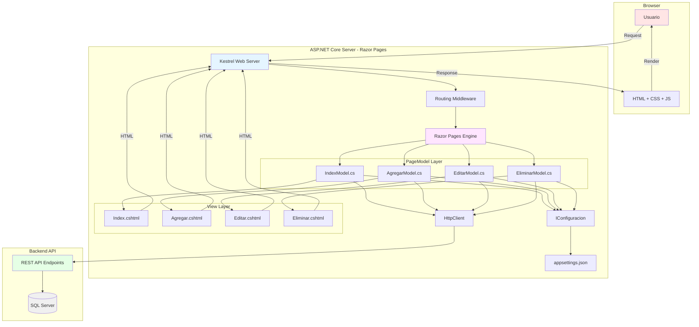
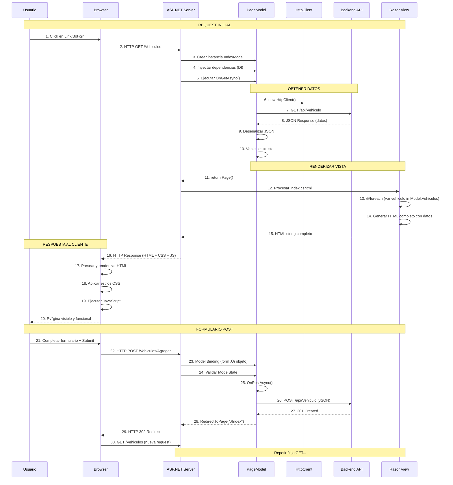
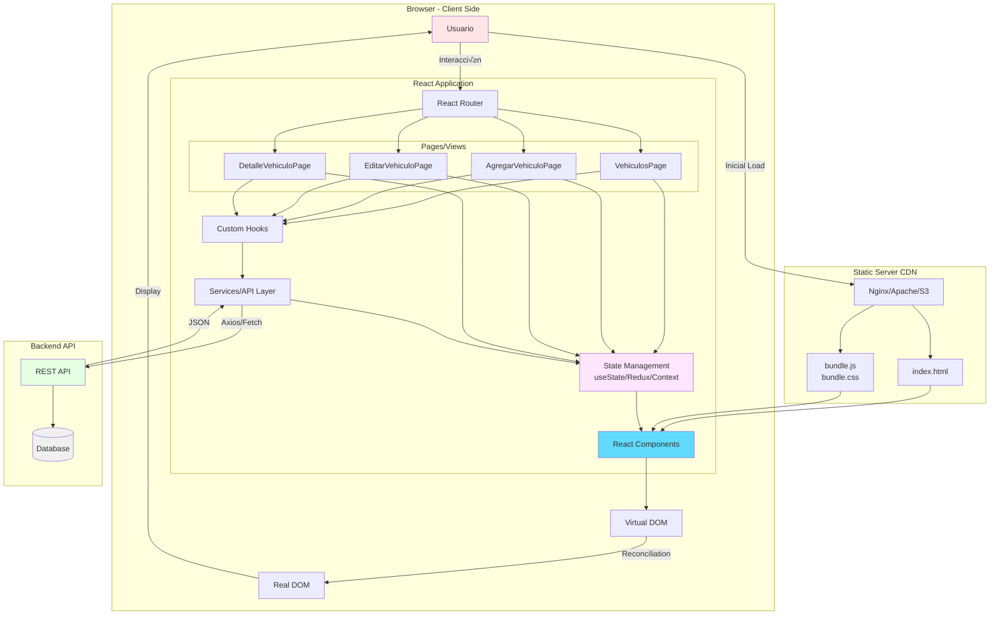
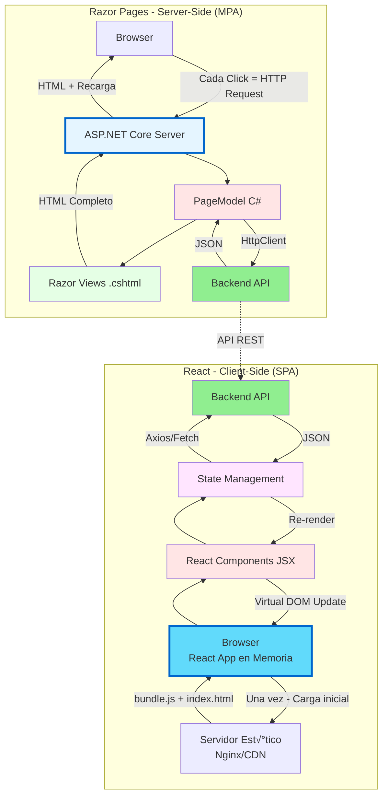
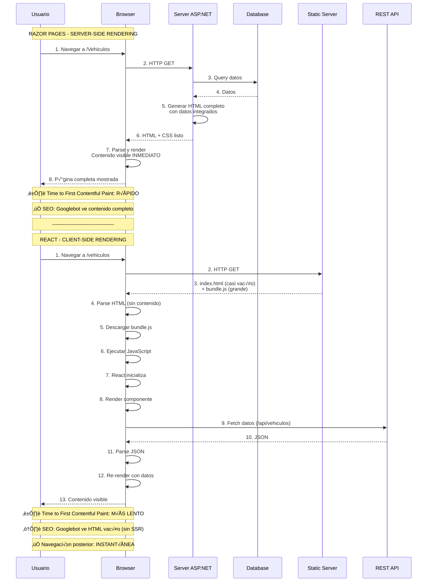
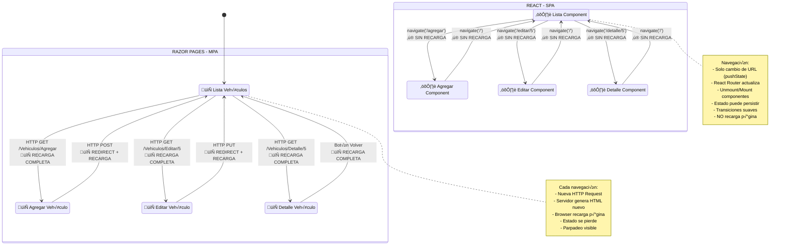
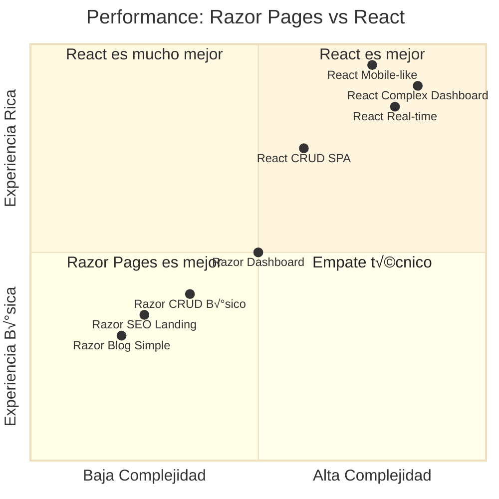
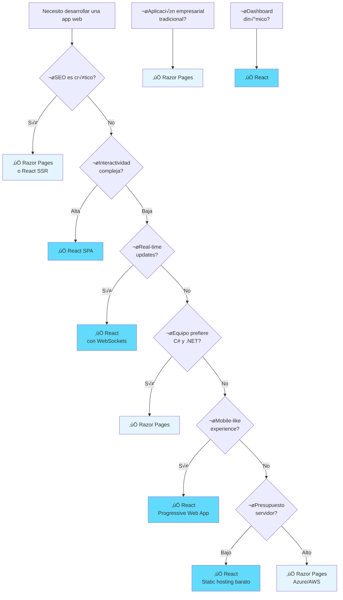

# Razor Pages vs React - Diagramas Comparativos

## 📊 Índice de Diagramas

1. [Arquitectura de Razor Pages](#1-arquitectura-de-razor-pages)
2. [Flujo de Request-Response en Razor Pages](#2-flujo-de-request-response-en-razor-pages)
3. [Ciclo de Vida de una P√°gina Razor](#3-ciclo-de-vida-de-una-p√°gina-razor)
4. [Arquitectura de React (SPA)](#4-arquitectura-de-react-spa)
5. [Comparación: Razor Pages vs React - Arquitectura General](#5-comparación-razor-pages-vs-react---arquitectura-general)
6. [Comparación: Flujo de Datos](#6-comparación-flujo-de-datos)
7. [Comparación: Renderizado](#7-comparación-renderizado)
8. [Comparación: Navegación](#8-comparación-navegación)
9. [Comparación: Gestión de Estado](#9-comparación-gestión-de-estado)
10. [Comparación: Performance y Experiencia de Usuario](#10-comparación-performance-y-experiencia-de-usuario)

---

## 1. Arquitectura de Razor Pages


```mermaid
graph TB
    subgraph "Browser"
        A[Usuario]
        B[HTML + CSS + JS]
    end
    
    subgraph "ASP.NET Core Server - Razor Pages"
        C[Kestrel Web Server]
        D[Routing Middleware]
        E[Razor Pages Engine]
        
        subgraph "PageModel Layer"
            F1[IndexModel.cs]
            F2[AgregarModel.cs]
            F3[EditarModel.cs]
            F4[EliminarModel.cs]
        end
        
        subgraph "View Layer"
            G1[Index.cshtml]
            G2[Agregar.cshtml]
            G3[Editar.cshtml]
            G4[Eliminar.cshtml]
        end
        
        H[HttpClient]
        I[IConfiguracion]
        J[appsettings.json]
    end
    
    subgraph "Backend API"
        K[REST API Endpoints]
        L[(SQL Server)]
    end
    
    A -->|Request| C
    C --> D
    D --> E
    E --> F1 & F2 & F3 & F4
    F1 --> G1
    F2 --> G2
    F3 --> G3
    F4 --> G4
    
    F1 & F2 & F3 & F4 --> H
    F1 & F2 & F3 & F4 --> I
    I --> J
    H --> K
    K --> L
    
    G1 & G2 & G3 & G4 -->|HTML| C
    C -->|Response| B
    B -->|Render| A
    
    style A fill:#FFE5E5
    style C fill:#E5F5FF
    style E fill:#FFE5FF
    style K fill:#E5FFE5
    style L fill:#F0F0F0
```

### Características Clave de Razor Pages:

- **Server-Side Rendering (SSR)**: HTML se genera en el servidor
- **Multi-Page Application (MPA)**: Cada acción recarga la página completa
- **PageModel Pattern**: Separación entre lógica (C#) y vista (Razor)
- **Tag Helpers**: Sintaxis limpia para generar HTML
- **HTTP Tradicional**: GET/POST con formularios HTML est√°ndar

---

## 2. Flujo de Request-Response en Razor Pages


```mermaid
sequenceDiagram
    participant U as Usuario
    participant B as Browser
    participant S as ASP.NET Server
    participant PM as PageModel
    participant HC as HttpClient
    participant API as Backend API
    participant V as Razor View
    
    Note over U,V: REQUEST INICIAL
    U->>B: 1. Click en Link/Botón
    B->>S: 2. HTTP GET /Vehiculos
    S->>PM: 3. Crear instancia IndexModel
    S->>PM: 4. Inyectar dependencias (DI)
    S->>PM: 5. Ejecutar OnGetAsync()
    
    Note over PM,API: OBTENER DATOS
    PM->>HC: 6. new HttpClient()
    PM->>API: 7. GET /api/Vehiculo
    API-->>PM: 8. JSON Response (datos)
    PM->>PM: 9. Deserializar JSON
    PM->>PM: 10. Vehiculos = lista
    
    Note over PM,V: RENDERIZAR VISTA
    PM-->>S: 11. return Page()
    S->>V: 12. Procesar Index.cshtml
    V->>V: 13. @foreach (var vehiculo in Model.Vehiculos)
    V->>V: 14. Generar HTML completo con datos
    V-->>S: 15. HTML string completo
    
    Note over B,U: RESPUESTA AL CLIENTE
    S-->>B: 16. HTTP Response (HTML + CSS + JS)
    B->>B: 17. Parsear y renderizar HTML
    B->>B: 18. Aplicar estilos CSS
    B->>B: 19. Ejecutar JavaScript
    B-->>U: 20. P√°gina visible y funcional
    
    Note over U,V: FORMULARIO POST
    U->>B: 21. Completar formulario + Submit
    B->>S: 22. HTTP POST /Vehiculos/Agregar
    S->>PM: 23. Model Binding (form ‚Üí objeto)
    S->>PM: 24. Validar ModelState
    PM->>PM: 25. OnPostAsync()
    PM->>API: 26. POST /api/Vehiculo (JSON)
    API-->>PM: 27. 201 Created
    PM-->>S: 28. RedirectToPage("./Index")
    S-->>B: 29. HTTP 302 Redirect
    B->>S: 30. GET /Vehiculos (nueva request)
    Note over S,V: Repetir flujo GET...
```

### Puntos Clave:

1. **Cada navegación = Nueva request HTTP completa**
2. **HTML generado en servidor** - el cliente solo recibe HTML final
3. **No hay JavaScript de framework** - opcional para interactividad
4. **Estado no persistente** - cada request es independiente
5. **SEO-friendly** - contenido ya en HTML inicial

---

## 3. Ciclo de Vida de una P√°gina Razor

```mermaid
flowchart TD
    A[HTTP Request llega al servidor] --> B{Tipo de Request?}
    
    B -->|GET| C[OnGetAsync/OnGet]
    B -->|POST| D[OnPostAsync/OnPost]
    B -->|PUT| E[OnPutAsync/OnPut]
    B -->|DELETE| F[OnDeleteAsync/OnDelete]
    
    C & D & E & F --> G[PageModel Constructor]
    G --> H[Dependency Injection]
    H --> I[Handler Method Execution]
    
    I --> J{ModelState.IsValid?}
    J -->|No| K[return Page]
    J -->|Sí| L[Lógica de Negocio]
    
    L --> M[Llamadas HTTP al API]
    M --> N[Deserializar Datos]
    N --> O[Asignar a Propiedades]
    
    K --> P[Razor Engine Procesa .cshtml]
    O --> Q{Tipo de Return?}
    
    Q -->|Page| P
    Q -->|RedirectToPage| R[HTTP 302 Redirect]
    Q -->|NotFound| S[HTTP 404]
    Q -->|BadRequest| T[HTTP 400]
    
    P --> U[Evaluar @model]
    U --> V[Ejecutar código Razor<br/>@if, @foreach, @{}]
    V --> W[Procesar Tag Helpers<br/>asp-page, asp-route-id]
    W --> X[Generar HTML completo]
    
    X --> Y[HTTP Response con HTML]
    R --> Y
    S --> Y
    T --> Y
    
    Y --> Z[Browser recibe y renderiza]
    
    style G fill:#E5F5FF
    style I fill:#FFE5E5
    style P fill:#E5FFE5
    style X fill:#FFF5E5
    style Z fill:#F5E5FF
    
    classDef handler fill:#FFE5E5,stroke:#FF0000,stroke-width:2px
    classDef render fill:#E5FFE5,stroke:#00AA00,stroke-width:2px
    class C,D,E,F handler
    class P,U,V,W,X render
```

### Fases del Ciclo:

1. **Request Processing**: Routing y creación de PageModel
2. **Handler Execution**: OnGet/OnPost/OnPut/OnDelete
3. **Data Fetching**: Llamadas a API externo
4. **Rendering**: Razor Engine procesa vista con datos
5. **Response**: HTML completo enviado al cliente

---

## 4. Arquitectura de React (SPA)


```mermaid
graph TB
    subgraph "Browser - Client Side"
        A[Usuario]
        
        subgraph "React Application"
            B[React Router]
            C[React Components]
            
            subgraph "Pages/Views"
                D1[VehiculosPage]
                D2[AgregarVehiculoPage]
                D3[EditarVehiculoPage]
                D4[DetalleVehiculoPage]
            end
            
            E[State Management<br/>useState/Redux/Context]
            F[Custom Hooks]
            G[Services/API Layer]
        end
        
        H[Virtual DOM]
        I[Real DOM]
    end
    
    subgraph "Static Server CDN"
        J[Nginx/Apache/S3]
        K[index.html]
        L[bundle.js<br/>bundle.css]
    end
    
    subgraph "Backend API"
        M[REST API]
        N[(Database)]
    end
    
    A -->|Inicial Load| J
    J --> K
    J --> L
    K --> C
    L --> C
    
    A -->|Interacción| B
    B --> D1 & D2 & D3 & D4
    D1 & D2 & D3 & D4 --> E
    D1 & D2 & D3 & D4 --> F
    F --> G
    G -->|Axios/Fetch| M
    M --> N
    M -->|JSON| G
    G --> E
    E --> C
    
    C --> H
    H -->|Reconciliation| I
    I -->|Display| A
    
    style A fill:#FFE5E5
    style C fill:#61DAFB
    style E fill:#FFE5FF
    style M fill:#E5FFE5
    style N fill:#F0F0F0
```

### Características Clave de React:

- **Single Page Application (SPA)**: Una sola carga HTML inicial
- **Client-Side Rendering (CSR)**: JavaScript genera contenido
- **Component-Based**: UI dividida en componentes reutilizables
- **Virtual DOM**: Reconciliación eficiente de cambios
- **Estado del Cliente**: Datos persistentes en memoria del navegador

---

## 5. Comparación: Razor Pages vs React - Arquitectura General


```mermaid
graph TB
    subgraph "Razor Pages - Server-Side (MPA)"
        RP_Browser[Browser]
        RP_Server[ASP.NET Core Server]
        RP_PM[PageModel C#]
        RP_View[Razor Views .cshtml]
        RP_API[Backend API]
        
        RP_Browser -->|Cada Click = HTTP Request| RP_Server
        RP_Server --> RP_PM
        RP_PM -->|HttpClient| RP_API
        RP_API -->|JSON| RP_PM
        RP_PM --> RP_View
        RP_View -->|HTML Completo| RP_Server
        RP_Server -->|HTML + Recarga| RP_Browser
        
        style RP_Server fill:#E5F5FF,stroke:#0066CC,stroke-width:3px
        style RP_PM fill:#FFE5E5
        style RP_View fill:#E5FFE5
    end
    
    subgraph "React - Client-Side (SPA)"
        R_Browser[Browser<br/>React App en Memoria]
        R_Static[Servidor Est√°tico<br/>Nginx/CDN]
        R_Components[React Components JSX]
        R_State[State Management]
        R_API[Backend API]
        
        R_Browser -->|Una vez - Carga inicial| R_Static
        R_Static -->|bundle.js + index.html| R_Browser
        R_Browser --> R_Components
        R_Components --> R_State
        R_State -->|Axios/Fetch| R_API
        R_API -->|JSON| R_State
        R_State -->|Re-render| R_Components
        R_Components -->|Virtual DOM Update| R_Browser
        
        style R_Browser fill:#61DAFB,stroke:#0066CC,stroke-width:3px
        style R_Components fill:#FFE5E5
        style R_State fill:#FFE5FF
    end
    
    RP_API -.API REST.-> R_API
    
    style RP_API fill:#90EE90
    style R_API fill:#90EE90
```

### Diferencias Fundamentales:

| Aspecto | Razor Pages | React |
|---------|-------------|-------|
| **Rendering** | Server-Side (HTML completo) | Client-Side (JavaScript) |
| **Navegación** | Full page reload | Virtual navigation (sin reload) |
| **Estado** | Request-based (stateless) | Persistente en memoria |
| **Servidor** | Genera HTML (CPU intensivo) | Solo sirve archivos est√°ticos |
| **SEO** | Excelente (HTML en respuesta) | Requiere SSR o SSG extra |

---

## 6. Comparación: Flujo de Datos


```mermaid
%%{init: {'theme':'base', 'themeVariables': { 'fontSize':'14px'}}}%%
flowchart LR
    subgraph "Razor Pages - Server-Side Flow"
        direction TB
        RP1[Usuario hace click]
        RP2[HTTP GET Request<br/>al Servidor]
        RP3[PageModel OnGet]
        RP4[HttpClient llama API]
        RP5[API retorna JSON]
        RP6[Deserializar a C# objects]
        RP7[Asignar a propiedades]
        RP8[Razor Engine<br/>genera HTML]
        RP9[HTML completo<br/>al browser]
        RP10[Browser renderiza<br/>RECARGA PÁGINA]
        
        RP1 --> RP2 --> RP3 --> RP4 --> RP5
        RP5 --> RP6 --> RP7 --> RP8 --> RP9 --> RP10
        
        style RP2 fill:#FFE5E5
        style RP8 fill:#E5FFE5
        style RP10 fill:#FFE5FF
    end
    
        subgraph "React - Client-Side Flow"
            direction TB
            R1[Usuario hace click]
            R2[Event Handler<br/>sin HTTP request]
            R3[useState/useEffect]
            R4[Fetch/Axios llama API]
            R5[API retorna JSON]
            R6[Parsear JSON]
            R7[setState actualiza]
            R8[React reconciliation<br/>Virtual DOM]
            R9[Actualiza solo<br/>componentes afectados]
            R10[SIN RECARGA<br/>cambio instant√°neo]
            
            R1 --> R2 --> R3 --> R4 --> R5
            R5 --> R6 --> R7 --> R8 --> R9 --> R10
            
            style R2 fill:#61DAFB
            style R8 fill:#61DAFB
            style R10 fill:#90EE90
        end
    
    style RP1 fill:#FFFFAA
    style R1 fill:#FFFFAA
```

### An√°lisis de Flujo:

#### Razor Pages:
- ‚úÖ Servidor controla todo el flujo
- ‚úÖ Datos nunca expuestos al cliente (m√°s seguro)
- ❌ Cada acción requiere round-trip al servidor
- ‚ùå Recarga completa de p√°gina (parpadeo)

#### React:
- ✅ Navegación instantánea (sin recarga)
- ✅ Actualización selectiva de UI
- ❌ Lógica expuesta en cliente (puede ser riesgo)
- ‚ùå Carga inicial m√°s pesada (todo el bundle)

---

## 7. Comparación: Renderizado


```mermaid
sequenceDiagram
    participant U as Usuario
    participant B as Browser
    
    Note over U,B: RAZOR PAGES - SERVER-SIDE RENDERING
    
    participant S as Server ASP.NET
    participant DB as Database
    
    U->>B: 1. Navegar a /Vehiculos
    B->>S: 2. HTTP GET
    S->>DB: 3. Query datos
    DB-->>S: 4. Datos
    S->>S: 5. Generar HTML completo<br/>con datos integrados
    S-->>B: 6. HTML + CSS listo
    B->>B: 7. Parse y render<br/>Contenido visible INMEDIATO
    B-->>U: 8. P√°gina completa mostrada
    
    Note over U,B: ⏱️ Time to First Contentful Paint: RÁPIDO
    Note over U,B: ‚úÖ SEO: Googlebot ve contenido completo
    
    Note over U,B: ------------------------------------
    
    Note over U,B: REACT - CLIENT-SIDE RENDERING
    
    participant ST as Static Server
    participant API as REST API
    
    U->>B: 1. Navegar a /vehiculos
    B->>ST: 2. HTTP GET
    ST-->>B: 3. index.html (casi vacío)<br/>+ bundle.js (grande)
    B->>B: 4. Parse HTML (sin contenido)
    B->>B: 5. Descargar bundle.js
    B->>B: 6. Ejecutar JavaScript
    B->>B: 7. React inicializa
    B->>B: 8. Render componente
    B->>API: 9. Fetch datos (/api/vehiculos)
    API-->>B: 10. JSON
    B->>B: 11. Parse JSON
    B->>B: 12. Re-render con datos
    B-->>U: 13. Contenido visible
    
    Note over U,B: ⏱️ Time to First Contentful Paint: MÁS LENTO
    Note over U,B: ⚠️ SEO: Googlebot ve HTML vacío (sin SSR)
    Note over U,B: ✅ Navegación posterior: INSTANTÁNEA
```

### Tiempos de Renderizado:

| Métrica | Razor Pages | React CSR | React SSR |
|---------|-------------|-----------|-----------|
| **First Load** | Rápido (HTML listo) | Lento (JS + data) | Rápido (híbrido) |
| **Time to Interactive** | R√°pido | Moderado | Moderado |
| **Navegación** | Lento (reload) | Instantáneo | Instantáneo |
| **SEO** | Excelente | Malo | Excelente |

---

## 8. Comparación: Navegación


```mermaid
stateDiagram-v2
    [*] --> ListaVehiculos
    
    state "RAZOR PAGES - MPA" as RP {
        state "📄 Lista Vehículos" as ListaVehiculos
        state "📄 Agregar Vehículo" as Agregar
        state "📄 Editar Vehículo" as Editar
        state "📄 Detalle Vehículo" as Detalle
        
        ListaVehiculos --> Agregar : HTTP GET /Vehiculos/Agregar<br/>🔄 RECARGA COMPLETA
        Agregar --> ListaVehiculos : HTTP POST<br/>🔄 REDIRECT + RECARGA
        ListaVehiculos --> Editar : HTTP GET /Vehiculos/Editar/5<br/>🔄 RECARGA COMPLETA
        Editar --> ListaVehiculos : HTTP PUT<br/>🔄 REDIRECT + RECARGA
        ListaVehiculos --> Detalle : HTTP GET /Vehiculos/Detalle/5<br/>🔄 RECARGA COMPLETA
        Detalle --> ListaVehiculos : Botón Volver<br/>🔄 RECARGA COMPLETA
        
        note right of ListaVehiculos
            Cada navegación:
            - Nueva HTTP Request
            - Servidor genera HTML nuevo
            - Browser recarga p√°gina
            - Estado se pierde
            - Parpadeo visible
        end note
    }
    
    state "REACT - SPA" as React {
        state "⚛️ Lista Component" as CompLista
        state "⚛️ Agregar Component" as CompAgregar
        state "⚛️ Editar Component" as CompEditar
        state "⚛️ Detalle Component" as CompDetalle
        
        CompLista --> CompAgregar : navigate('/agregar')<br/>‚ú® SIN RECARGA
        CompAgregar --> CompLista : navigate('/')<br/>‚ú® SIN RECARGA
        CompLista --> CompEditar : navigate('/editar/5')<br/>‚ú® SIN RECARGA
        CompEditar --> CompLista : navigate('/')<br/>‚ú® SIN RECARGA
        CompLista --> CompDetalle : navigate('/detalle/5')<br/>‚ú® SIN RECARGA
        CompDetalle --> CompLista : navigate('/')<br/>‚ú® SIN RECARGA
        
        note right of CompLista
            Navegación:
            - Solo cambio de URL (pushState)
            - React Router actualiza
            - Unmount/Mount componentes
            - Estado puede persistir
            - Transiciones suaves
            - NO recarga p√°gina
        end note
    }
```

### Experiencia de Usuario:

#### Razor Pages (MPA):
- ‚úÖ URLs significativas y compartibles
- ✅ Botón back/forward del browser funciona naturalmente
- ❌ Parpadeo en cada navegación
- ❌ Pérdida de estado (ej: posición scroll)
- ‚ùå Re-descarga assets (CSS/JS) si no hay cache

#### React (SPA):
- ✅ Navegación fluida sin parpadeo
- ‚úÖ Animaciones y transiciones suaves
- ‚úÖ Estado persistente entre navegaciones
- ⚠️ Requiere configuración para SEO y deep linking
- ⚠️ Botón back/forward requiere React Router

---

## 9. Comparación: Gestión de Estado


```mermaid
graph TB
    subgraph "Razor Pages - Stateless"
        RP_Req1[Request 1:<br/>GET /Vehiculos]
        RP_PM1[PageModel<br/>Vehiculos = null]
        RP_API1[API Call]
        RP_Data1[Vehiculos = lista]
        RP_HTML1[HTML generado]
        RP_Destroy1[💀 PageModel destruido<br/>Estado perdido]
        
        RP_Req2[Request 2:<br/>GET /Vehiculos/Agregar]
        RP_PM2[Nuevo PageModel<br/>Fresh start]
        RP_NoState[‚ùå No hay estado previo<br/>Todo desde cero]
        
        RP_Req1 --> RP_PM1 --> RP_API1 --> RP_Data1
        RP_Data1 --> RP_HTML1 --> RP_Destroy1
        RP_Destroy1 --> RP_Req2 --> RP_PM2 --> RP_NoState
        
        note1[Cada request es independiente<br/>No hay memoria entre p√°ginas]
        RP_NoState --- note1
        
        style RP_Destroy1 fill:#FFE5E5
        style RP_NoState fill:#FFE5E5
    end
    
    subgraph "React - Stateful"
        R_Init[App inicializa]
        R_State[const vehiculos, setVehiculos = useState]
        R_Load[useEffect fetch API]
        R_Data[setVehiculos lista]
        R_Persist[‚úÖ Estado en memoria]
        
        R_Nav1[Navigate a /agregar]
        R_Keep1[✅ Estado persiste<br/>vehiculos todavía en memoria]
        
        R_Nav2[Navigate back a /]
        R_Keep2[‚úÖ Lista a√∫n disponible<br/>No re-fetch necesario]
        
        R_Global[Context API / Redux<br/>Estado global compartido]
        
        R_Init --> R_State --> R_Load --> R_Data
        R_Data --> R_Persist
        R_Persist --> R_Nav1 --> R_Keep1
        R_Keep1 --> R_Nav2 --> R_Keep2
        R_Keep2 -.-> R_Persist
        R_State --> R_Global
        
        note2[Estado persiste mientras<br/>app est√° activa]
        R_Global --- note2
        
        style R_Persist fill:#90EE90
        style R_Keep1 fill:#90EE90
        style R_Keep2 fill:#90EE90
    end
    
    style RP_Req1 fill:#E5F5FF
    style RP_Req2 fill:#E5F5FF
    style R_Init fill:#61DAFB
```

### Estrategias de Estado:

#### Razor Pages:
- **TempData**: Persistir entre redirects (una sola vez)
- **Session**: Almacenar en servidor (consume memoria)
- **Cookies**: Pequeños datos en cliente
- **Query String**: Pasar datos en URL
- **Hidden Fields**: Mantener en formulario

#### React:
- **useState**: Estado local de componente
- **useContext**: Compartir entre componentes cercanos
- **Redux/Zustand**: Estado global centralizado
- **React Query**: Cache de datos de API
- **Local Storage**: Persistencia en navegador

---

## 10. Comparación: Performance y Experiencia de Usuario


```mermaid
%%{init: {'theme':'base'}}%%
quadrantChart
    title Performance: Razor Pages vs React
    x-axis Baja Complejidad --> Alta Complejidad
    y-axis Experiencia B√°sica --> Experiencia Rica
    quadrant-1 React es mejor
    quadrant-2 React es mucho mejor
    quadrant-3 Razor Pages es mejor
    quadrant-4 Empate técnico
    
    Razor Blog Simple: [0.2, 0.3]
    Razor CRUD B√°sico: [0.35, 0.4]
    Razor Dashboard: [0.5, 0.5]
    React CRUD SPA: [0.6, 0.75]
    React Real-time: [0.8, 0.85]
    React Complex Dashboard: [0.85, 0.9]
    Razor SEO Landing: [0.25, 0.35]
    React Mobile-like: [0.75, 0.95]
```

### Matriz de Decisión:


```mermaid
flowchart TD
    Start[Necesito desarrollar una app web]
    
    Start --> Q1{¿SEO es crítico?}
    Q1 -->|Sí| RazorPages1[✅ Razor Pages<br/>o React SSR]
    Q1 -->|No| Q2{¬øInteractividad<br/>compleja?}
    
    Q2 -->|Alta| React1[‚úÖ React SPA]
    Q2 -->|Baja| Q3{¬øReal-time<br/>updates?}
    
    Q3 -->|Sí| React2[✅ React<br/>con WebSockets]
    Q3 -->|No| Q4{¬øEquipo prefiere<br/>C# y .NET?}
    
    Q4 -->|Sí| RazorPages2[✅ Razor Pages]
    Q4 -->|No| Q5{¬øMobile-like<br/>experience?}
    
    Q5 -->|Sí| React3[✅ React<br/>Progressive Web App]
    Q5 -->|No| Q6{¬øPresupuesto<br/>servidor?}
    
    Q6 -->|Bajo| React4[‚úÖ React<br/>Static hosting barato]
    Q6 -->|Alto| RazorPages3[‚úÖ Razor Pages<br/>Azure/AWS]
    
    Q7[¿Aplicación empresarial<br/>tradicional?]
    Q7 --> RazorPages4[‚úÖ Razor Pages]
    
    Q8[¬øDashboard<br/>din√°mico?]
    Q8 --> React5[‚úÖ React]
    
    style RazorPages1 fill:#E5F5FF
    style RazorPages2 fill:#E5F5FF
    style RazorPages3 fill:#E5F5FF
    style RazorPages4 fill:#E5F5FF
    style React1 fill:#61DAFB
    style React2 fill:#61DAFB
    style React3 fill:#61DAFB
    style React4 fill:#61DAFB
    style React5 fill:#61DAFB
```

---

## üìä Tabla Comparativa Final

| Criterio | Razor Pages (MPA) | React (SPA) | Ganador |
|----------|-------------------|-------------|---------|
| **SEO out-of-the-box** | ‚úÖ Excelente | ‚ùå Requiere SSR | Razor Pages |
| **Time to First Paint** | ✅ Rápido | ⚠️ Moderado | Razor Pages |
| **Navegación fluida** | ❌ Recarga | ✅ Instantánea | React |
| **Estado persistente** | ‚ùå Solo con Session | ‚úÖ Nativo | React |
| **Curva aprendizaje** | ✅ Más simple | ⚠️ Más compleja | Razor Pages |
| **Hosting** | ⚠️ Servidor ASP.NET | ✅ CDN estático | React |
| **Costo servidor** | ⚠️ Mayor (CPU) | ✅ Menor | React |
| **Seguridad** | ✅ Lógica oculta | ⚠️ Lógica expuesta | Razor Pages |
| **Interactividad** | ⚠️ Con JS extra | ✅ Nativa | React |
| **Real-time** | ‚ùå Complejo | ‚úÖ Natural | React |
| **Debugging** | ✅ Visual Studio | ⚠️ Dev Tools | Razor Pages |
| **TypeScript** | ‚ùå Solo JS | ‚úÖ Primera clase | React |
| **Testing** | ‚úÖ Unit + Integration | ‚úÖ Unit + E2E | Empate |
| **Mobile experience** | ‚ùå B√°sica | ‚úÖ App-like | React |
| **Offline support** | ‚ùå No | ‚úÖ PWA | React |

---

## 🎯 Casos de Uso Recomendados

### Usar **Razor Pages** cuando:

- ✅ Aplicación tipo **CRUD empresarial** tradicional
- ✅ **SEO es crítico** (e-commerce, blogs, marketing)
- ‚úÖ Equipo tiene experiencia en **C# y .NET**
- ‚úÖ Presupuesto limitado (no requiere desarrollador JS)
- ✅ Aplicación con **formularios complejos** (model binding)
- ✅ **Seguridad** es prioritaria (lógica en servidor)
- ✅ Necesitas **integración profunda con .NET** (Identity, EF)
- ✅ Clientes con **conexión lenta** (páginas ligeras)

### Usar **React** cuando:

- ✅ Experiencia **tipo aplicación móvil** en web
- ‚úÖ Dashboards con **datos en tiempo real**
- ‚úÖ Muchas **interacciones sin recarga**
- ‚úÖ **PWA** (Progressive Web App) con offline support
- ‚úÖ Equipo especializado en **JavaScript/TypeScript**
- ‚úÖ API ya existe y solo necesitas **frontend**
- ‚úÖ **Microservicios**: frontend independiente
- ‚úÖ Necesitas **animaciones complejas** y transiciones

### **Híbrido** (lo mejor de ambos):

- 🔄 **Next.js con React**: SSR + SPA navigation
- 🔄 **Blazor Server**: Razor con interactividad (SignalR)
- 🔄 **Razor Pages + React Islands**: Páginas SSR con componentes interactivos

---

## 🔍 Ejemplo Práctico: CRUD de Vehículos

### Razor Pages - Agregar Vehículo
```
1. Usuario navega a /Vehiculos/Agregar
2. Servidor ejecuta AgregarModel.OnGetAsync()
3. Carga marcas/modelos desde API
4. Genera HTML con formulario pre-poblado
5. Usuario completa y presiona Submit
6. POST /Vehiculos/Agregar con form data
7. Servidor ejecuta AgregarModel.OnPostAsync()
8. Valida ModelState
9. Envía JSON al API
10. RedirectToPage("./Index")
11. Nueva request GET /Vehiculos
12. P√°gina lista actualizada
```

### React - Agregar Vehículo
```
1. Usuario hace click "Agregar"
2. navigate('/agregar') - SIN HTTP REQUEST
3. AgregarComponent monta
4. useEffect fetches marcas/modelos (una vez)
5. Usuario completa formulario
6. onSubmit handler
7. Validación en cliente (yup/zod)
8. fetch('/api/vehiculo', {method: 'POST', body: JSON})
9. await respuesta
10. navigate('/') - SIN RECARGA
11. ListComponent ya tiene estado o refetch
12. Lista actualizada instant√°neamente
```

**Diferencia clave**: 
- Razor Pages: **3 HTTP requests** (GET form + POST data + GET redirect)
- React: **2 HTTP requests** (GET marcas/modelos + POST vehículo), navegación instantánea

---

## üìö Recursos Adicionales

### Razor Pages
- [Microsoft Docs - Razor Pages](https://learn.microsoft.com/aspnet/core/razor-pages)
- [Razor Pages vs MVC](https://learn.microsoft.com/aspnet/core/tutorials/choose-web-ui)

### React
- [React Official Docs](https://react.dev)
- [React Router](https://reactrouter.com)
- [Next.js (React SSR)](https://nextjs.org)

### Comparativas
- [SPA vs MPA](https://developer.mozilla.org/en-US/docs/Glossary/SPA)
- [SSR vs CSR](https://web.dev/rendering-on-the-web/)

---

**Conclusión**: No hay un ganador absoluto. La elección depende de los **requisitos específicos del proyecto**, **experiencia del equipo** y **objetivos de negocio**.
