# Arquitectura Razor Pages - Vehiculos.WEB

## 📘 Guía Educativa Completa

Este documento explica la arquitectura completa del proyecto **Vehiculos.WEB**, desarrollado con **ASP.NET Core Razor Pages** que consume el API RESTful **Vehiculo.API**.

---

## 🎯 ¿Qué es Vehiculos.WEB?

**Vehiculos.WEB** es una aplicación web **Server-Side Rendered (SSR)** construida con **Razor Pages** que permite gestionar vehículos, marcas y modelos mediante una interfaz web tradicional (no SPA).

### Características Principales

- ✅ **Server-Side Rendering**: HTML generado en servidor
- ✅ **MPA (Multi-Page Application)**: Cada acción navega a nueva página
- ✅ **Bootstrap 5**: UI responsiva y moderna
- ✅ **HttpClient**: Consume API RESTful
- ✅ **PageModel Pattern**: Separación de lógica y vista
- ✅ **Tag Helpers**: Sintaxis limpia en views
- ✅ **IConfiguration**: Gestión de endpoints

---

## 🏗️ Arquitectura General del Proyecto

```mermaid
graph TB
    subgraph "Cliente (Browser)"
        A[Usuario]
    end
    
    subgraph "Vehiculos.WEB Server (ASP.NET Core)"
        B[Razor Pages]
        B1[Index.cshtml + IndexModel]
        B2[Agregar.cshtml + AgregarModel]
        B3[Editar.cshtml + EditarModel]
        B4[Eliminar.cshtml + EliminarModel]
        B5[Detalle.cshtml + DetalleModel]
        
        C[HttpClient]
        D[IConfiguracion]
        E[appsettings.json]
    end
    
    subgraph "Vehiculo.API (Backend)"
        F[REST API Endpoints]
        F1[GET /api/Vehiculo]
        F2[POST /api/Vehiculo]
        F3[PUT /api/Vehiculo/id]
        F4[DELETE /api/Vehiculo/id]
        F5[GET /api/Vehiculo/id]
    end
    
    A -->|1. Request GET /Vehiculos| B
    B --> B1 & B2 & B3 & B4 & B5
    
    B1 -->|2. OnGet()| C
    C -->|3. HTTP GET| F1
    F1 -->|4. JSON Response| C
    C -->|5. Deserialize| B1
    B1 -->|6. HTML Response| A
    
    B2 -->|HTTP POST| F2
    B3 -->|HTTP PUT| F3
    B4 -->|HTTP DELETE| F4
    B5 -->|HTTP GET| F5
    
    D --> E
    B1 --> D
    B2 --> D
    B3 --> D
    B4 --> D
    B5 --> D
    
    style A fill:#61dafb
    style B fill:#e1f5ff
    style C fill:#fff4e1
    style F fill:#ffe1e1
    style D fill:#e1ffe1
    
    classDef page fill:#d1e7ff,stroke:#333,stroke-width:2px
    class B1,B2,B3,B4,B5 page
```

---

## 📁 Estructura de Carpetas

```
Vehiculos.WEB/
├── Abstracciones/                    # Modelos compartidos
│   └── Modelos/
│       ├── APIEndPoint.cs           # Config de endpoints
│       ├── Marca.cs
│       ├── Modelo.cs
│       └── Vehiculo.cs
│
├── Reglas/                           # Lógica de configuración
│   └── Configuracion.cs
│
└── Web/                              # Aplicación Razor Pages
    ├── wwwroot/                      # Assets estáticos
    │   ├── css/
    │   │   └── site.css
    │   ├── js/
    │   │   └── site.js
    │   ├── images/
    │   └── lib/                      # Bootstrap, jQuery
    │
    ├── Pages/                        # Razor Pages
    │   ├── _ViewImports.cshtml      # Imports globales
    │   ├── _ViewStart.cshtml        # Layout predeterminado
    │   ├── Index.cshtml              # Página inicio
    │   ├── Index.cshtml.cs           # PageModel inicio
    │   ├── Privacy.cshtml
    │   ├── Privacy.cshtml.cs
    │   ├── Error.cshtml
    │   ├── Error.cshtml.cs
    │   │
    │   ├── Shared/                   # Componentes compartidos
    │   │   ├── _Layout.cshtml       # Layout principal
    │   │   └── _ValidationScriptsPartial.cshtml
    │   │
    │   └── Vehiculos/                # CRUD de Vehículos
    │       ├── Index.cshtml          # Listar
    │       ├── Index.cshtml.cs
    │       ├── Agregar.cshtml        # Crear
    │       ├── Agregar.cshtml.cs
    │       ├── Editar.cshtml         # Actualizar
    │       ├── Editar.cshtml.cs
    │       ├── Eliminar.cshtml       # Borrar
    │       ├── Eliminar.cshtml.cs
    │       ├── Detalle.cshtml        # Ver detalle
    │       └── Detalle.cshtml.cs
    │
    ├── Program.cs                    # Configuración startup
    └── appsettings.json              # Configuración app
```

---

## 🔄 Flujo Completo de una Request

### Ejemplo: Listar Vehículos (GET /Vehiculos)

```mermaid
sequenceDiagram
    participant U as Usuario (Browser)
    participant RP as Razor Page (Index.cshtml)
    participant PM as PageModel (IndexModel)
    participant HC as HttpClient
    participant API as Vehiculo.API
    participant DB as SQL Server
    
    U->>RP: 1. Click "Ver Vehículos"
    Note over U,RP: GET /Vehiculos
    
    RP->>PM: 2. OnGetAsync()
    Note over PM: Método handler ejecutado
    
    PM->>HC: 3. GetAsync(endpoint)
    Note over HC: GET https://localhost:7001/api/Vehiculo
    
    HC->>API: 4. HTTP GET Request
    API->>DB: 5. Query stored procedure
    DB-->>API: 6. Datos vehiculos
    API-->>HC: 7. JSON Response
    
    HC-->>PM: 8. HttpResponseMessage
    PM->>PM: 9. JsonSerializer.Deserialize<List<VehiculoResponse>>()
    PM->>PM: 10. Vehiculos = lista
    
    PM-->>RP: 11. Page()
    Note over RP: Renderizar con Model.Vehiculos
    
    RP->>RP: 12. @foreach (var vehiculo in Model.Vehiculos)
    RP->>RP: 13. Generar HTML con Bootstrap
    
    RP-->>U: 14. HTML completo renderizado
    Note over U: Browser muestra página
```



---

## 🧩 Componentes de Razor Pages

### 1. PageModel (.cshtml.cs)

**Responsabilidad**: Lógica de la página (backend).

```csharp
// Pages/Vehiculos/Index.cshtml.cs
public class IndexModel : PageModel
{
    private readonly IConfiguracion _configuracion;
    public List<VehiculoResponse> Vehiculos { get; set; } = new List<VehiculoResponse>();

    public IndexModel(IConfiguracion configuracion)
    {
        _configuracion = configuracion;
    }

    public async Task OnGetAsync()
    {
        // 1. Obtener endpoint de configuración
        string endpoint = _configuracion.ObtenerMetodo("API", "Vehiculos");
        
        // 2. Crear HttpClient
        using var cliente = new HttpClient();
        
        // 3. Hacer request GET
        var solicitud = new HttpRequestMessage(HttpMethod.Get, endpoint);
        var respuesta = await cliente.SendAsync(solicitud);
        
        // 4. Verificar éxito
        respuesta.EnsureSuccessStatusCode();
        
        // 5. Leer contenido JSON
        var contenido = await respuesta.Content.ReadAsStringAsync();
        
        // 6. Deserializar a modelos
        Vehiculos = JsonSerializer.Deserialize<List<VehiculoResponse>>(contenido, new JsonSerializerOptions
        {
            PropertyNameCaseInsensitive = true
        });
    }
}
```

**Características**:
- ✅ Hereda de `PageModel`
- ✅ Propiedades públicas: accesibles desde la vista
- ✅ Métodos `OnGet`, `OnPost`, `OnPut`, `OnDelete`: handlers HTTP
- ✅ Dependency Injection: constructor recibe servicios
- ✅ `Task<IActionResult>`: permite redirigir, retornar errores

### 2. Razor View (.cshtml)

**Responsabilidad**: Presentación (frontend).

```html
<!-- Pages/Vehiculos/Index.cshtml -->
@page
@model Vehiculos.WEB.Pages.Vehiculos.IndexModel
@{
    ViewData["Title"] = "Vehículos";
}

<div class="container mt-4">
    <div class="row mb-4">
        <div class="col">
            <h1 class="display-4">
                <i class="bi bi-car-front-fill"></i> Vehículos
            </h1>
        </div>
        <div class="col text-end">
            <a asp-page="./Agregar" class="btn btn-primary">
                <i class="bi bi-plus-circle"></i> Agregar Vehículo
            </a>
        </div>
    </div>

    @if (!Model.Vehiculos.Any())
    {
        <div class="alert alert-info">
            <i class="bi bi-info-circle"></i>
            No hay vehículos registrados. <a asp-page="./Agregar">Agregar primero</a>.
        </div>
    }
    else
    {
        <div class="row row-cols-1 row-cols-md-3 g-4">
            @foreach (var vehiculo in Model.Vehiculos)
            {
                <div class="col">
                    <div class="card h-100 shadow-sm">
                        <div class="card-header bg-primary text-white">
                            <h5 class="card-title mb-0">
                                @vehiculo.Marca @vehiculo.Modelo
                            </h5>
                        </div>
                        <div class="card-body">
                            <p><strong>Placa:</strong> @vehiculo.Placa</p>
                            <p><strong>Color:</strong> @vehiculo.Color</p>
                            <p><strong>Año:</strong> @vehiculo.Anio</p>
                            <p><strong>Precio:</strong> @vehiculo.Precio.ToString("C")</p>
                        </div>
                        <div class="card-footer bg-transparent">
                            <div class="btn-group w-100" role="group">
                                <a asp-page="./Detalle" 
                                   asp-route-id="@vehiculo.Id" 
                                   class="btn btn-sm btn-info text-white">
                                    <i class="bi bi-info-square"></i> Ver
                                </a>
                                <a asp-page="./Editar" 
                                   asp-route-id="@vehiculo.Id" 
                                   class="btn btn-sm btn-warning">
                                    <i class="bi bi-pencil-square"></i> Editar
                                </a>
                                <a asp-page="./Eliminar" 
                                   asp-route-id="@vehiculo.Id" 
                                   class="btn btn-sm btn-danger">
                                    <i class="bi bi-trash"></i> Eliminar
                                </a>
                            </div>
                        </div>
                    </div>
                </div>
            }
        </div>
    }
</div>
```

**Características**:
- ✅ `@page`: Define que es una Razor Page (tiene URL propia)
- ✅ `@model`: Define el tipo de PageModel
- ✅ `Model.Propiedad`: Accede a datos del PageModel
- ✅ `asp-page`: Tag Helper para links entre páginas
- ✅ `asp-route-id`: Pasa parámetros en URL
- ✅ Sintaxis Razor: `@`, `@if`, `@foreach`, `@{}` para C# embebido

---

## 🔄 CRUD Completo

### 1. CREATE (Agregar)

#### PageModel

```csharp
// Pages/Vehiculos/Agregar.cshtml.cs
public class AgregarModel : PageModel
{
    private readonly IConfiguracion _configuracion;

    [BindProperty]
    public VehiculoRequest Vehiculo { get; set; } = new();

    public List<Marca> Marcas { get; set; } = new();
    public List<Modelo> Modelos { get; set; } = new();

    public AgregarModel(IConfiguracion configuracion)
    {
        _configuracion = configuracion;
    }

    // GET: Mostrar formulario
    public async Task OnGetAsync()
    {
        // Cargar marcas y modelos para los select
        await CargarDatosFormulario();
    }

    // POST: Enviar formulario
    public async Task<IActionResult> OnPostAsync()
    {
        if (!ModelState.IsValid)
        {
            await CargarDatosFormulario();
            return Page(); // Volver a mostrar formulario con errores
        }

        string endpoint = _configuracion.ObtenerMetodo("API", "Vehiculos");
        
        using var cliente = new HttpClient();
        
        // Serializar objeto a JSON
        var json = JsonSerializer.Serialize(Vehiculo);
        var content = new StringContent(json, Encoding.UTF8, "application/json");
        
        // POST request
        var respuesta = await cliente.PostAsync(endpoint, content);
        respuesta.EnsureSuccessStatusCode();
        
        // Redirigir a Index
        return RedirectToPage("./Index");
    }

    private async Task CargarDatosFormulario()
    {
        string endpointMarcas = _configuracion.ObtenerMetodo("API", "Marcas");
        using var cliente = new HttpClient();
        
        var respuesta = await cliente.GetAsync(endpointMarcas);
        var contenido = await respuesta.Content.ReadAsStringAsync();
        Marcas = JsonSerializer.Deserialize<List<Marca>>(contenido, new JsonSerializerOptions
        {
            PropertyNameCaseInsensitive = true
        });
        
        // Similar para Modelos...
    }
}
```

#### View

```html
<!-- Pages/Vehiculos/Agregar.cshtml -->
@page
@model Vehiculos.WEB.Pages.Vehiculos.AgregarModel

<div class="container mt-4">
    <h2><i class="bi bi-plus-circle"></i> Agregar Vehículo</h2>
    
    <form method="post">
        <div asp-validation-summary="ModelOnly" class="text-danger"></div>
        
        <div class="mb-3">
            <label asp-for="Vehiculo.IdModelo" class="form-label">Modelo</label>
            <select asp-for="Vehiculo.IdModelo" class="form-select">
                <option value="">-- Seleccione --</option>
                @foreach (var modelo in Model.Modelos)
                {
                    <option value="@modelo.Id">@modelo.Nombre</option>
                }
            </select>
            <span asp-validation-for="Vehiculo.IdModelo" class="text-danger"></span>
        </div>
        
        <div class="mb-3">
            <label asp-for="Vehiculo.Placa" class="form-label">Placa</label>
            <input asp-for="Vehiculo.Placa" class="form-control" />
            <span asp-validation-for="Vehiculo.Placa" class="text-danger"></span>
        </div>
        
        <div class="mb-3">
            <label asp-for="Vehiculo.Color" class="form-label">Color</label>
            <input asp-for="Vehiculo.Color" class="form-control" />
            <span asp-validation-for="Vehiculo.Color" class="text-danger"></span>
        </div>
        
        <div class="mb-3">
            <label asp-for="Vehiculo.Anio" class="form-label">Año</label>
            <input asp-for="Vehiculo.Anio" type="number" class="form-control" />
            <span asp-validation-for="Vehiculo.Anio" class="text-danger"></span>
        </div>
        
        <div class="mb-3">
            <label asp-for="Vehiculo.Precio" class="form-label">Precio</label>
            <input asp-for="Vehiculo.Precio" type="number" step="0.01" class="form-control" />
            <span asp-validation-for="Vehiculo.Precio" class="text-danger"></span>
        </div>
        
        <div class="mb-3">
            <label asp-for="Vehiculo.CorreoPropietario" class="form-label">Correo Propietario</label>
            <input asp-for="Vehiculo.CorreoPropietario" type="email" class="form-control" />
            <span asp-validation-for="Vehiculo.CorreoPropietario" class="text-danger"></span>
        </div>
        
        <div class="mb-3">
            <label asp-for="Vehiculo.TelefonoPropietario" class="form-label">Teléfono</label>
            <input asp-for="Vehiculo.TelefonoPropietario" class="form-control" />
            <span asp-validation-for="Vehiculo.TelefonoPropietario" class="text-danger"></span>
        </div>
        
        <div class="d-flex justify-content-between">
            <button type="submit" class="btn btn-primary">
                <i class="bi bi-save"></i> Guardar
            </button>
            <a asp-page="./Index" class="btn btn-secondary">
                <i class="bi bi-x-circle"></i> Cancelar
            </a>
        </div>
    </form>
</div>

@section Scripts {
    <partial name="_ValidationScriptsPartial" />
}
```

**Tag Helpers importantes**:
- `asp-for`: Bind a propiedad del modelo
- `asp-validation-for`: Mostrar errores de validación
- `asp-validation-summary`: Resumen de errores

---

### 2. READ (Detalle)

```csharp
// Pages/Vehiculos/Detalle.cshtml.cs
public class DetalleModel : PageModel
{
    private readonly IConfiguracion _configuracion;
    
    public VehiculoDetalle Vehiculo { get; set; }
    
    public DetalleModel(IConfiguracion configuracion)
    {
        _configuracion = configuracion;
    }
    
    public async Task<IActionResult> OnGetAsync(Guid id)
    {
        string endpoint = _configuracion.ObtenerMetodo("API", "Vehiculos");
        
        using var cliente = new HttpClient();
        var respuesta = await cliente.GetAsync($"{endpoint}/{id}");
        
        if (!respuesta.IsSuccessStatusCode)
        {
            return NotFound();
        }
        
        var contenido = await respuesta.Content.ReadAsStringAsync();
        Vehiculo = JsonSerializer.Deserialize<VehiculoDetalle>(contenido, new JsonSerializerOptions
        {
            PropertyNameCaseInsensitive = true
        });
        
        return Page();
    }
}
```

```html
<!-- Pages/Vehiculos/Detalle.cshtml -->
@page "{id:guid}"
@model Vehiculos.WEB.Pages.Vehiculos.DetalleModel

<div class="container mt-4">
    <div class="card shadow">
        <div class="card-header bg-info text-white">
            <h3><i class="bi bi-info-circle"></i> Detalle del Vehículo</h3>
        </div>
        <div class="card-body">
            <dl class="row">
                <dt class="col-sm-3">Marca</dt>
                <dd class="col-sm-9">@Model.Vehiculo.Marca</dd>
                
                <dt class="col-sm-3">Modelo</dt>
                <dd class="col-sm-9">@Model.Vehiculo.Modelo</dd>
                
                <dt class="col-sm-3">Placa</dt>
                <dd class="col-sm-9"><span class="badge bg-secondary">@Model.Vehiculo.Placa</span></dd>
                
                <dt class="col-sm-3">Color</dt>
                <dd class="col-sm-9">@Model.Vehiculo.Color</dd>
                
                <dt class="col-sm-3">Año</dt>
                <dd class="col-sm-9">@Model.Vehiculo.Anio</dd>
                
                <dt class="col-sm-3">Precio</dt>
                <dd class="col-sm-9">@Model.Vehiculo.Precio.ToString("C")</dd>
                
                <dt class="col-sm-3">Propietario</dt>
                <dd class="col-sm-9">
                    <i class="bi bi-envelope"></i> @Model.Vehiculo.CorreoPropietario<br />
                    <i class="bi bi-telephone"></i> @Model.Vehiculo.TelefonoPropietario
                </dd>
                
                <dt class="col-sm-3">Revisión Técnica</dt>
                <dd class="col-sm-9">
                    @if (Model.Vehiculo.RevisionValida)
                    {
                        <span class="badge bg-success">
                            <i class="bi bi-check-circle"></i> Válida
                        </span>
                    }
                    else
                    {
                        <span class="badge bg-danger">
                            <i class="bi bi-x-circle"></i> Vencida
                        </span>
                    }
                </dd>
                
                <dt class="col-sm-3">Registro</dt>
                <dd class="col-sm-9">
                    @if (Model.Vehiculo.RegistroValido)
                    {
                        <span class="badge bg-success">
                            <i class="bi bi-check-circle"></i> Válido
                        </span>
                    }
                    else
                    {
                        <span class="badge bg-danger">
                            <i class="bi bi-x-circle"></i> Inválido
                        </span>
                    }
                </dd>
            </dl>
        </div>
        <div class="card-footer">
            <a asp-page="./Editar" asp-route-id="@Model.Vehiculo.Id" class="btn btn-warning">
                <i class="bi bi-pencil"></i> Editar
            </a>
            <a asp-page="./Eliminar" asp-route-id="@Model.Vehiculo.Id" class="btn btn-danger">
                <i class="bi bi-trash"></i> Eliminar
            </a>
            <a asp-page="./Index" class="btn btn-secondary">
                <i class="bi bi-arrow-left"></i> Volver
            </a>
        </div>
    </div>
</div>
```

**Routing**:
- `@page "{id:guid}"`: Define parámetro de ruta con constraint
- URL resultante: `/Vehiculos/Detalle/12345678-1234-1234-1234-123456789abc`

---

### 3. UPDATE (Editar)

```csharp
// Pages/Vehiculos/Editar.cshtml.cs
public class EditarModel : PageModel
{
    private readonly IConfiguracion _configuracion;
    
    [BindProperty]
    public VehiculoRequest Vehiculo { get; set; }
    
    [BindProperty]
    public Guid Id { get; set; }
    
    public List<Modelo> Modelos { get; set; } = new();
    
    public EditarModel(IConfiguracion configuracion)
    {
        _configuracion = configuracion;
    }
    
    // GET: Cargar datos existentes
    public async Task<IActionResult> OnGetAsync(Guid id)
    {
        Id = id;
        
        // 1. Obtener vehículo actual
        string endpoint = _configuracion.ObtenerMetodo("API", "Vehiculos");
        using var cliente = new HttpClient();
        var respuesta = await cliente.GetAsync($"{endpoint}/{id}");
        
        if (!respuesta.IsSuccessStatusCode)
        {
            return NotFound();
        }
        
        var contenido = await respuesta.Content.ReadAsStringAsync();
        var vehiculoDetalle = JsonSerializer.Deserialize<VehiculoDetalle>(contenido, new JsonSerializerOptions
        {
            PropertyNameCaseInsensitive = true
        });
        
        // 2. Mapear a VehiculoRequest
        Vehiculo = new VehiculoRequest
        {
            IdModelo = vehiculoDetalle.IdModelo,
            Placa = vehiculoDetalle.Placa,
            Color = vehiculoDetalle.Color,
            Anio = vehiculoDetalle.Anio,
            Precio = vehiculoDetalle.Precio,
            CorreoPropietario = vehiculoDetalle.CorreoPropietario,
            TelefonoPropietario = vehiculoDetalle.TelefonoPropietario
        };
        
        // 3. Cargar modelos para select
        await CargarModelos();
        
        return Page();
    }
    
    // POST: Actualizar
    public async Task<IActionResult> OnPostAsync()
    {
        if (!ModelState.IsValid)
        {
            await CargarModelos();
            return Page();
        }
        
        string endpoint = _configuracion.ObtenerMetodo("API", "Vehiculos");
        
        using var cliente = new HttpClient();
        var json = JsonSerializer.Serialize(Vehiculo);
        var content = new StringContent(json, Encoding.UTF8, "application/json");
        
        // PUT request
        var respuesta = await cliente.PutAsync($"{endpoint}/{Id}", content);
        respuesta.EnsureSuccessStatusCode();
        
        return RedirectToPage("./Index");
    }
    
    private async Task CargarModelos()
    {
        // Similar a Agregar...
    }
}
```

**Diferencias con Agregar**:
- `OnGetAsync(Guid id)`: Recibe ID para cargar datos existentes
- `OnPostAsync()`: Usa `PUT` en vez de `POST`
- Formulario pre-poblado con datos actuales

---

### 4. DELETE (Eliminar)

```csharp
// Pages/Vehiculos/Eliminar.cshtml.cs
public class EliminarModel : PageModel
{
    private readonly IConfiguracion _configuracion;
    
    public VehiculoDetalle Vehiculo { get; set; }
    
    public EliminarModel(IConfiguracion configuracion)
    {
        _configuracion = configuracion;
    }
    
    // GET: Mostrar confirmación
    public async Task<IActionResult> OnGetAsync(Guid id)
    {
        string endpoint = _configuracion.ObtenerMetodo("API", "Vehiculos");
        
        using var cliente = new HttpClient();
        var respuesta = await cliente.GetAsync($"{endpoint}/{id}");
        
        if (!respuesta.IsSuccessStatusCode)
        {
            return NotFound();
        }
        
        var contenido = await respuesta.Content.ReadAsStringAsync();
        Vehiculo = JsonSerializer.Deserialize<VehiculoDetalle>(contenido, new JsonSerializerOptions
        {
            PropertyNameCaseInsensitive = true
        });
        
        return Page();
    }
    
    // POST: Confirmar eliminación
    public async Task<IActionResult> OnPostAsync(Guid id)
    {
        string endpoint = _configuracion.ObtenerMetodo("API", "Vehiculos");
        
        using var cliente = new HttpClient();
        var respuesta = await cliente.DeleteAsync($"{endpoint}/{id}");
        
        respuesta.EnsureSuccessStatusCode();
        
        return RedirectToPage("./Index");
    }
}
```

```html
<!-- Pages/Vehiculos/Eliminar.cshtml -->
@page "{id:guid}"
@model Vehiculos.WEB.Pages.Vehiculos.EliminarModel

<div class="container mt-4">
    <div class="alert alert-danger">
        <h3><i class="bi bi-exclamation-triangle"></i> Confirmar Eliminación</h3>
        <p>¿Está seguro que desea eliminar este vehículo?</p>
    </div>
    
    <div class="card">
        <div class="card-body">
            <dl class="row">
                <dt class="col-sm-3">Marca y Modelo</dt>
                <dd class="col-sm-9">@Model.Vehiculo.Marca @Model.Vehiculo.Modelo</dd>
                
                <dt class="col-sm-3">Placa</dt>
                <dd class="col-sm-9">@Model.Vehiculo.Placa</dd>
                
                <dt class="col-sm-3">Color</dt>
                <dd class="col-sm-9">@Model.Vehiculo.Color</dd>
                
                <dt class="col-sm-3">Año</dt>
                <dd class="col-sm-9">@Model.Vehiculo.Anio</dd>
                
                <dt class="col-sm-3">Precio</dt>
                <dd class="col-sm-9">@Model.Vehiculo.Precio.ToString("C")</dd>
            </dl>
        </div>
    </div>
    
    <form method="post" class="mt-3">
        <button type="submit" class="btn btn-danger">
            <i class="bi bi-trash"></i> Sí, Eliminar
        </button>
        <a asp-page="./Index" class="btn btn-secondary">
            <i class="bi bi-x-circle"></i> Cancelar
        </button>
    </form>
</div>
```

**Patrón POST-Redirect-GET (PRG)**:
- GET: Muestra confirmación
- POST: Ejecuta acción
- Redirect: Evita re-submit al refrescar

---

## ⚙️ Configuración (IConfiguracion)

```csharp
// Reglas/Configuracion.cs
public class Configuracion : IConfiguracion
{
    private readonly IConfiguration _configuration;
    
    public Configuracion(IConfiguration configuration)
    {
        _configuration = configuration;
    }
    
    public string ObtenerMetodo(string seccion, string metodo)
    {
        return _configuration[$"{seccion}:{metodo}"];
    }
}
```

```json
// appsettings.json
{
  "API": {
    "Vehiculos": "https://localhost:7001/api/Vehiculo",
    "Marcas": "https://localhost:7001/api/Marca",
    "Modelos": "https://localhost:7001/api/Modelo"
  }
}
```

**Uso**:
```csharp
string endpoint = _configuracion.ObtenerMetodo("API", "Vehiculos");
// Resultado: "https://localhost:7001/api/Vehiculo"
```

---

## 🎨 Layout y Componentes Compartidos

### _Layout.cshtml

```html
<!-- Pages/Shared/_Layout.cshtml -->
<!DOCTYPE html>
<html lang="es">
<head>
    <meta charset="utf-8" />
    <meta name="viewport" content="width=device-width, initial-scale=1.0" />
    <title>@ViewData["Title"] - Vehiculos</title>
    <link rel="stylesheet" href="~/lib/bootstrap/dist/css/bootstrap.min.css" />
    <link rel="stylesheet" href="~/css/site.css" asp-append-version="true" />
    <link rel="stylesheet" href="https://cdn.jsdelivr.net/npm/bootstrap-icons@1.10.0/font/bootstrap-icons.css">
</head>
<body>
    <header>
        <nav class="navbar navbar-expand-lg navbar-dark bg-primary">
            <div class="container">
                <a class="navbar-brand" asp-page="/Index">
                    <i class="bi bi-car-front"></i> Vehiculos.WEB
                </a>
                <button class="navbar-toggler" type="button" data-bs-toggle="collapse" data-bs-target="#navbarNav">
                    <span class="navbar-toggler-icon"></span>
                </button>
                <div class="collapse navbar-collapse" id="navbarNav">
                    <ul class="navbar-nav ms-auto">
                        <li class="nav-item">
                            <a class="nav-link" asp-page="/Index">Inicio</a>
                        </li>
                        <li class="nav-item">
                            <a class="nav-link" asp-page="/Vehiculos/Index">Vehículos</a>
                        </li>
                        <li class="nav-item">
                            <a class="nav-link" asp-page="/Privacy">Privacidad</a>
                        </li>
                    </ul>
                </div>
            </div>
        </nav>
    </header>
    
    <main role="main" class="pb-3">
        @RenderBody()
    </main>
    
    <footer class="border-top footer text-muted">
        <div class="container text-center">
            &copy; 2025 - Vehiculos.WEB
        </div>
    </footer>
    
    <script src="~/lib/jquery/dist/jquery.min.js"></script>
    <script src="~/lib/bootstrap/dist/js/bootstrap.bundle.min.js"></script>
    <script src="~/js/site.js" asp-append-version="true"></script>
    
    @await RenderSectionAsync("Scripts", required: false)
</body>
</html>
```

**Características**:
- ✅ `@RenderBody()`: Inserta contenido de la página
- ✅ `@RenderSectionAsync("Scripts")`: Secciones opcionales
- ✅ `asp-append-version`: Cache busting
- ✅ Bootstrap 5 + Bootstrap Icons

### _ViewImports.cshtml

```html
<!-- Pages/_ViewImports.cshtml -->
@using Vehiculos.WEB
@using Vehiculos.WEB.Pages
@using Abstracciones.Modelos
@namespace Vehiculos.WEB.Pages
@addTagHelper *, Microsoft.AspNetCore.Mvc.TagHelpers
```

**Función**: Imports globales para todas las vistas.

### _ViewStart.cshtml

```html
<!-- Pages/_ViewStart.cshtml -->
@{
    Layout = "_Layout";
}
```

**Función**: Define layout predeterminado.

---

## 📊 Razor Pages vs React

```mermaid
graph TB
    subgraph "Razor Pages (MPA - Server-Side)"
        A1[Browser Request]
        A2[IIS / Kestrel Server]
        A3[PageModel OnGet/OnPost]
        A4[HttpClient → API]
        A5[Render .cshtml → HTML]
        A6[Send Full HTML]
        A7[Browser Display]
        
        A1 --> A2
        A2 --> A3
        A3 --> A4
        A4 --> A3
        A3 --> A5
        A5 --> A6
        A6 --> A7
    end
    
    subgraph "React (SPA - Client-Side)"
        B1[Initial HTML + JS Bundle]
        B2[Browser]
        B3[React Component Mount]
        B4[fetch → API]
        B5[Update State]
        B6[Re-render Virtual DOM]
        B7[Update Real DOM]
        
        B1 --> B2
        B2 --> B3
        B3 --> B4
        B4 --> B5
        B5 --> B6
        B6 --> B7
        B7 -.Navigation.-> B3
    end
    
    style A2 fill:#e1f5ff
    style A5 fill:#fff4e1
    style B3 fill:#61dafb
    style B6 fill:#fff4e1
```



| Aspecto | **Razor Pages (MPA)** | **React (SPA)** |
|---------|----------------------|----------------|
| **Rendering** | Server-Side | Client-Side |
| **Navegación** | Full page reload | Sin reload (client-side routing) |
| **Estado** | No persiste entre requests | Persiste en memoria (useState, Context) |
| **SEO** | ✅ Excelente (HTML completo desde inicio) | ⚠️ Requiere SSR o pre-rendering |
| **Primera Carga** | ✅ Rápida (HTML ya renderizado) | ⚠️ Más lenta (descargar JS, ejecutar) |
| **Interactividad** | ⚠️ Requiere JavaScript adicional | ✅ Muy interactiva por defecto |
| **Forms** | HTML forms nativos + model binding | Controlled components |
| **Validación** | Server-side + client-side (unobtrusive) | Client-side (HTML5 + custom) |
| **Complejidad** | ⚠️ Menos moderna | ✅ Ecosistema rico |
| **Uso de Bandwidth** | ⚠️ HTML completo cada request | ✅ Solo JSON |

---

## 🔄 Lifecycle de una Razor Page

```mermaid
sequenceDiagram
    participant B as Browser
    participant Server as Kestrel Server
    participant PM as PageModel
    participant View as .cshtml
    participant API as External API
    
    B->>Server: HTTP Request (GET /Vehiculos)
    Server->>PM: Instantiate PageModel
    PM->>PM: Constructor (DI)
    PM->>PM: OnGetAsync()
    PM->>API: HttpClient.GetAsync()
    API-->>PM: JSON Response
    PM->>PM: JsonSerializer.Deserialize()
    PM->>PM: Set Properties
    PM-->>Server: Return Page()
    Server->>View: Render .cshtml with Model
    View->>View: @foreach, @if, etc.
    View-->>Server: HTML string
    Server-->>B: HTTP Response (HTML)
    B->>B: Display HTML
    
    Note over B,API: Nuevo request para otra acción
    
    B->>Server: POST /Vehiculos/Agregar
    Server->>PM: Instantiate PageModel
    PM->>PM: Model Binding (form data → Vehiculo)
    PM->>PM: Validate ModelState
    
    alt ModelState.IsValid
        PM->>API: HttpClient.PostAsync(JSON)
        API-->>PM: 201 Created
        PM-->>Server: RedirectToPage("./Index")
        Server-->>B: HTTP 302 Redirect
        B->>Server: GET /Vehiculos (nueva request)
    else Invalid
        PM-->>Server: Page() (re-display form)
        Server->>View: Render with errors
        View-->>B: HTML con mensajes de error
    end
```



**Métodos Handler**:
- `OnGet()` / `OnGetAsync()`: Maneja GET requests
- `OnPost()` / `OnPostAsync()`: Maneja POST requests
- `OnPut()` / `OnPutAsync()`: Maneja PUT requests (custom)
- `OnDelete()` / `OnDeleteAsync()`: Maneja DELETE requests (custom)

**Model Binding**:
- `[BindProperty]`: Propiedad se bindea automáticamente desde form data

---

## 🛠️ Program.cs (Startup Configuration)

```csharp
// Web/Program.cs
var builder = WebApplication.CreateBuilder(args);

// Agregar servicios al contenedor DI
builder.Services.AddRazorPages();
builder.Services.AddScoped<IConfiguracion, Configuracion>();

var app = builder.Build();

// Configurar pipeline de middleware
if (!app.Environment.IsDevelopment())
{
    app.UseExceptionHandler("/Error");
    app.UseHsts();
}

app.UseHttpsRedirection();
app.UseStaticFiles();       // Sirve archivos de wwwroot
app.UseRouting();
app.UseAuthorization();
app.MapRazorPages();        // Mapea rutas de Razor Pages

app.Run();
```

**Middleware pipeline**:
1. `UseHttpsRedirection()`: Redirige HTTP → HTTPS
2. `UseStaticFiles()`: Sirve CSS, JS, imágenes
3. `UseRouting()`: Mapea URLs a páginas
4. `UseAuthorization()`: Valida permisos
5. `MapRazorPages()`: Endpoints de Razor Pages

---

## 🎯 Ventajas de Razor Pages

### 1. SEO-Friendly
- HTML completo generado en servidor
- Crawlers ven contenido inmediatamente

### 2. Simple para CRUD
- Patrón page-based intuitivo
- Menos boilerplate que MVC tradicional

### 3. Performance Inicial
- Primera carga rápida (HTML ya renderizado)
- No necesita descargar/ejecutar JS pesado

### 4. Formularios Nativos
- Model binding automático
- Validación server-side robusta

### 5. Sin Complejidad de Build
- No requiere Webpack, Babel, etc.
- Compilación simple

---

## 📝 Limitaciones y Trade-offs

### 1. Interactividad Limitada
- Requiere JavaScript adicional para UI rica
- No hay Virtual DOM ni re-rendering inteligente

### 2. Full Page Reload
- Cada acción navega a nueva página
- No hay persistencia de estado entre páginas

### 3. Bandwidth
- Cada request envía HTML completo
- React solo envía JSON (más eficiente)

### 4. User Experience
- Menos fluida que SPA para aplicaciones complejas
- Loading completo entre páginas

---

## 💡 Cuándo Usar Razor Pages

**✅ Buena opción para**:
- Aplicaciones CRUD tradicionales
- Formularios simples
- Aplicaciones donde SEO es crítico
- Equipos familiarizados con .NET
- Prototipos rápidos

**❌ No ideal para**:
- Aplicaciones altamente interactivas
- Dashboards en tiempo real
- Aplicaciones tipo Gmail/Facebook
- Cuando se requiere offline-first

---

## 📚 Comparación con API Backend

| Capa | **Vehiculo.API** | **Vehiculos.WEB** |
|------|------------------|-------------------|
| **Presentación** | JSON (REST) | HTML (Razor) |
| **Lógica** | Flujo → Reglas → DA | PageModel → HttpClient |
| **Datos** | SQL Server (Dapper) | API REST (HttpClient) |
| **Estado** | Stateless | Stateless |
| **Arquitectura** | Layered (6 capas) | MPA (Page-based) |
| **Reutilización** | ✅ Múltiples clientes | ❌ Solo navegador |

---

## 🚀 Mejoras Potenciales

1. **Partial Page Updates**: AJAX para secciones específicas
2. **Loading Indicators**: Spinners durante requests
3. **Client-Side Validation**: jQuery Validation
4. **Toast Notifications**: Feedback visual
5. **Paginación**: Para listados grandes
6. **Búsqueda/Filtrado**: En listados
7. **Caché**: ResponseCache attribute
8. **Autenticación**: Identity integration
9. **ViewComponents**: Reutilización de UI
10. **Partial Views**: Fragmentos compartidos

---

## 📚 Referencias

- [Razor Pages Documentation](https://learn.microsoft.com/en-us/aspnet/core/razor-pages/)
- [Tag Helpers](https://learn.microsoft.com/en-us/aspnet/core/mvc/views/tag-helpers/intro)
- [Model Binding](https://learn.microsoft.com/en-us/aspnet/core/mvc/models/model-binding)
- [Bootstrap 5](https://getbootstrap.com/docs/5.3/)

---

**Anterior**: [Documentación de Vehiculo.API](./vehiculo-api-arquitectura.md)
